# Архитектура платформы удалённого управления реальными RC-машинами

**Статус:** целевая архитектура публичного MVP  
**Версия:** 1.0  
**Дата:** 25 июля 2026 года  
**Основной источник требований:** [техническое задание](RC_Racing_Platform_Technical_Specification_RU.md)  
**UI-референсы:** [каталог макетов](ui/)  

> Этот документ объясняет, как должна быть устроена система, какие компоненты в ней нужны и как они взаимодействуют. При расхождении с техническим заданием приоритет имеет техническое задание.

## Карта документа

| Разделы | Содержание |
|---|---|
| 1–4 | Общая модель, ограничения, контекст и критические пути |
| 5–7 | Облако, edge-сервер и электроника машины |
| 8–11 | WebRTC, медиа, засечка, сценарии и состояния |
| 12–14 | Данные, API и безопасность |
| 15–19 | Наблюдаемость, отказы, выпуск, масштабирование и тесты |
| 20–22 | Архитектурные решения, связь с UI и итоговая модель |

---

## 1. Краткое описание архитектуры

Платформа состоит не из одного приложения, а из четырёх связанных контуров:

1. **Облачный контур** — аккаунты, Stripe, баланс времени, очередь, поездки, сезоны, рейтинг, жалобы, администрирование и WebRTC-сигналинг.
2. **Локальный контур площадки** — фактические часы поездки, операторское управление, состояние машин, засечка, общие камеры, локальный архив и работа при временной потере облака.
3. **Контур реального времени машины** — прямой WebRTC между браузером и Raspberry Pi, проводной UART между Raspberry Pi и ESP32, независимый fail-safe на ESP32.
4. **Медийный и доказательный контур** — публичная трансляция, две общие камеры, пятичасовой циклический архив и ручной экспорт материалов жалоб.

Главный архитектурный принцип: **облачные и медийные функции не должны находиться на критическом пути безопасного управления машиной**.

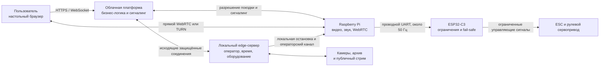

### 1.1. Ключевые решения MVP

| Область | Решение |
|---|---|
| Облачное приложение | Модульный монолит на TypeScript/Node.js с отдельными фоновыми процессами |
| Пользовательский интерфейс | React и Next.js |
| Основная база | Управляемая PostgreSQL |
| Оперативные состояния | Управляемый Redis, не являющийся финансовым источником истины |
| Связь браузера с машиной | Прямой WebRTC; TURN только когда прямой маршрут невозможен |
| Управление автомобилем | WebRTC DataChannel до Pi, затем проводной UART до ESP32 |
| Последний уровень безопасности | ESP32, независимо ограничивающая скорость и включающая нейтраль при потере свежих команд |
| Сервер площадки | Ubuntu LTS и Docker Compose |
| Raspberry Pi | Облегчённый Linux, systemd-службы, без Docker в MVP |
| Засечка | Адаптер `TimingProvider`; основной кандидат OpenStint, резервный Trackmate |
| Публичная трансляция | Локальная композиция с отправкой на внешнюю видеоплатформу |
| Бортовая запись | Не выполняется в MVP |
| Общие камеры | Две проводные камеры и пятичасовой локальный циклический архив |
| Масштабирование | Сначала вертикальное и модульное; выделение сервисов только по измеримой причине |

---

## 2. Архитектурные приоритеты и ограничения

### 2.1. Порядок приоритетов

Архитектурные решения принимаются в следующем порядке:

1. безопасная остановка машины;
2. минимальная задержка управления;
3. корректный учёт оплаченного времени;
4. доступность операторского управления;
5. стабильность видео;
6. точность засечки и рейтинга;
7. публичная трансляция и аналитика.

Практическое следствие: при нехватке ресурсов первой отключается публичная трансляция, но не операторский stop, учёт времени или поток управляющих команд.

### 2.2. Границы MVP

Архитектура MVP рассчитана на:

- одну площадку и одну активную конфигурацию трассы;
- примерно две пользовательские и одну резервную машину;
- конфигурационную поддержку до восьми машин;
- один облачный регион;
- одну общую FIFO-очередь;
- одного активного управляющего пользователя на машину;
- работу площадки около 12 часов в сутки;
- круглосуточную доступность сайта, аккаунтов, платежей и рейтинга;
- локального дежурного оператора во время работы трассы.

### 2.3. Что намеренно не используется

- Kubernetes;
- десятки микросервисов;
- управление машиной со смартфона;
- Wi-Fi между Raspberry Pi и ESP32;
- постоянные входящие порты на площадке и Raspberry Pi;
- GPS и запись полного потока команд;
- запись бортового видео;
- автоматическая выгрузка видеодоказательств в облако;
- облачный API как посредник для каждого управляющего пакета.

---

## 3. Контекст системы

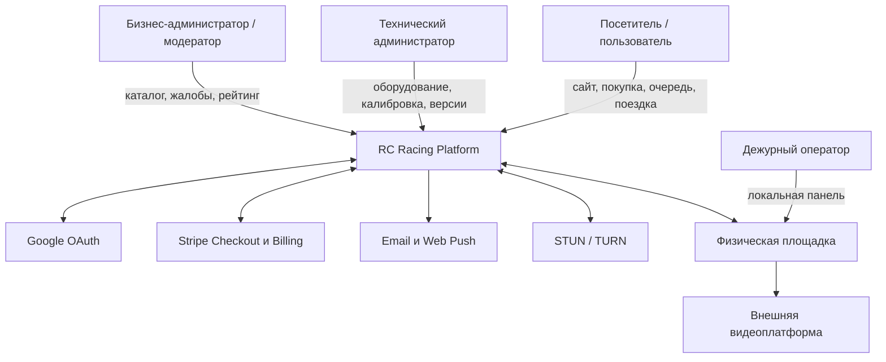

Публичный API и интерфейс не раскрывают точный адрес, город или страну площадки. Прямой WebRTC при этом может раскрыть публичный IP интернет-канала; система не обещает полной технической анонимности региона.

### 3.1. Пользовательские клиенты

| Клиент | Возможности |
|---|---|
| Настольный браузер | Полный путь: preflight, покупка, очередь, управление, результаты |
| Смартфон | Главная, трансляция, аккаунт, покупки, баланс, рейтинги, история и уведомления |
| Смартфон в MVP | Не может входить в живую очередь и управлять машиной |
| Операторский браузер | Локальная полноэкранная панель на площадке |
| Административный браузер | Облачные техническая и бизнес-панели |

---

## 4. Разделение контуров и критических путей

### 4.1. Четыре контура

| Контур | Основные данные | Допустимая задержка | Поведение при сбое |
|---|---|---:|---|
| Облачный бизнес-контур | деньги, баланс времени, очередь, права, история | сотни миллисекунд | активная поездка может продолжиться локально; новые блоки запрещаются |
| Контур управления | руль, газ, тормоз, видео и звук | десятки миллисекунд | ESP32 включает нейтраль через 120–150 мс без свежих команд |
| Edge-контур площадки | фактическое время, operator stop, оборудование | локальная сеть | останавливает машину при потере критических компонентов |
| Медийный контур | публичная композиция и записи камер | секунды | отключается без остановки управления |

### 4.2. Что находится на критическом пути управления

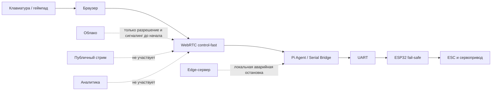

После установления WebRTC обычные команды управления и бортовое видео не проходят через центральный бизнес-API или edge-сервер.

---

## 5. Облачная архитектура

### 5.1. Развёртываемые компоненты

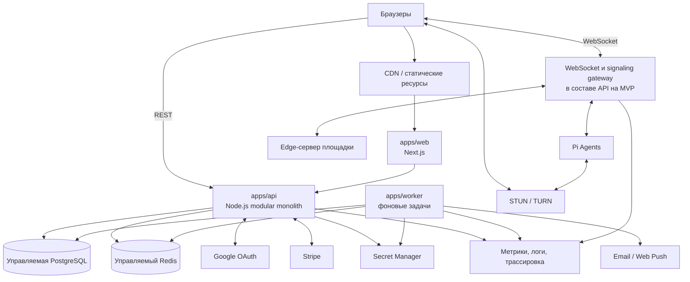

`apps/api`, `apps/worker` и signaling могут масштабироваться независимо как процессы или контейнеры, оставаясь частями одного модульного приложения и одного набора доменных контрактов.

### 5.2. Модули модульного монолита

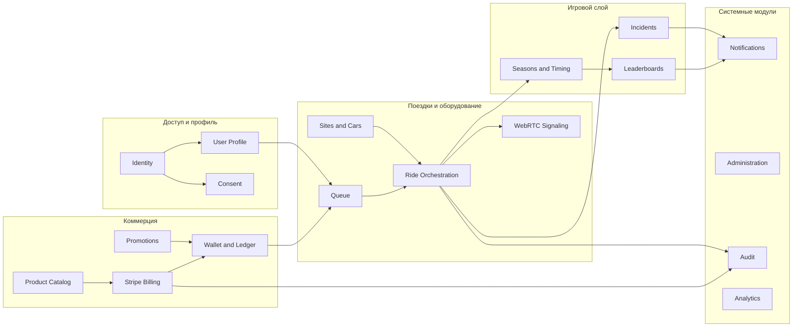

Правила модульности:

- модуль владеет своими таблицами и изменяет их только через свой прикладной интерфейс;
- финансовый журнал изменяется только модулем `Wallet and Ledger`;
- состояние поездки изменяется только `Ride Orchestration`;
- межмодульные побочные действия выполняются через доменные события и transactional outbox;
- WebSocket доставляет изменения, но не является единственным источником истины;
- после важного события клиент получает версионированный снимок либо подтверждает состояние через REST.

### 5.3. PostgreSQL и Redis

| Хранилище | Хранит | Не должно хранить как единственный источник |
|---|---|---|
| PostgreSQL | деньги, секунды баланса, покупки, права, поездки, события состояний, круги, решения модерации, версии конфигураций и аудит | краткоживущие подключения и кэш |
| Redis | живая очередь, присутствие вкладок, временные блокировки, маршрутизация WebSocket, краткоживущий кэш | баланс, финансовые операции, окончательную историю поездок |

При потере Redis:

- баланс и история не меняются;
- очередь восстанавливается из контрольных данных PostgreSQL, если это можно сделать без нарушения FIFO;
- иначе очередь честно сбрасывается, а пользователи получают уведомление;
- один аккаунт всё равно не может получить две активные поездки благодаря ограничениям PostgreSQL.

### 5.4. Фоновые процессы

`apps/worker` выполняет:

- обработку подписанных Stripe webhook-событий;
- периодическую сверку покупок и подписок;
- выдачу минут подписки и перенос остатков;
- отправку email и push-уведомлений;
- истечение предложений машин;
- построение и закрытие сезонных снимков;
- повторную доставку outbox-событий;
- очистку данных по политикам хранения;
- агрегацию технических и продуктовых показателей.

Каждая задача должна быть идемпотентной и иметь стабильный ключ повторного выполнения.

---

## 6. Архитектура локального сервера площадки

### 6.1. Сервисы Docker Compose

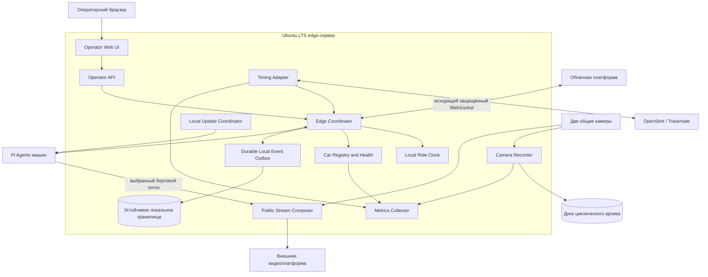

Для локального outbox рекомендуется встроенное хранилище с журналированием, например SQLite в WAL-режиме, принадлежащее только `Edge Coordinator`. Конкретная технология может быть заменена, если сохраняются обязательные свойства: устойчивость после перезапуска, последовательные номера, идемпотентная повторная доставка и отсутствие общей сетевой зависимости.

### 6.2. Ответственность edge-сервера

- фактическое измерение активного времени монотонными часами;
- локальная проверка готовности машины;
- operator stop одной или всех машин;
- локальный перехват и безопасный возврат;
- работа текущей поездки при временной потере облака;
- запрет новых поездок и новых оплачиваемых блоков без облака;
- нормализация событий засечки;
- запись двух общих камер;
- публичная композиция;
- накопление неподтверждённых облаком событий;
- локальные метрики и журналы;
- координация обновлений свободных машин.

Оператор работает через полноэкранный браузерный интерфейс и не получает административного доступа к Ubuntu.

### 6.3. Приоритет процессов при перегрузке

1. operator stop и связь с машинами;
2. Local Ride Clock;
3. Timing Adapter;
4. Camera Recorder;
5. синхронизация с облаком;
6. Public Stream Composer.

### 6.4. Сетевые сегменты площадки

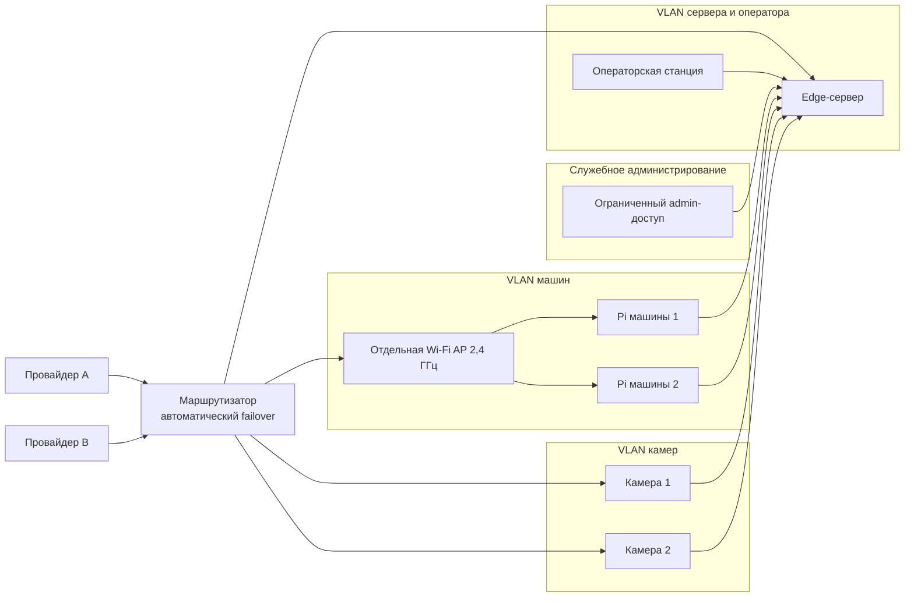

Межсегментные правила должны запрещать машине произвольный доступ к операторской станции, камерам и другим машинам. Разрешаются только конкретные исходящие и локальные соединения к облаку, edge-сервисам, STUN/TURN и утверждённым службам обновления.

---

## 7. Архитектура электроники и ПО машины

### 7.1. Компоненты на машине

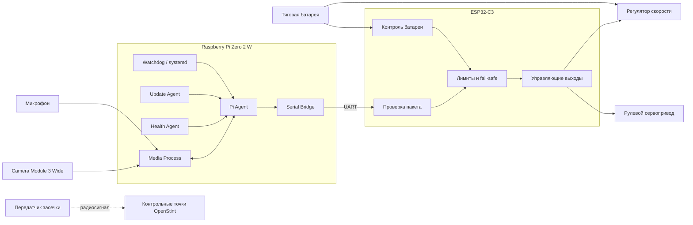

Передатчик засечки электрически является отдельным компонентом и не передаёт данные в ESP32.

### 7.2. Программная модель Raspberry Pi

- облегчённый воспроизводимый Linux-образ;
- systemd-службы вместо Docker;
- отдельный media process;
- Pi Agent для поездки, WebRTC и разрешений;
- Serial Bridge для UART;
- Health Agent для температуры, загрузки, Wi-Fi, кадров и heartbeat;
- Update Agent для подписанных обновлений;
- watchdog;
- минимальный локальный буфер журналов;
- уникальные `device_id` и сертификат после одноразового зачисления.

### 7.3. Контур управляющих команд

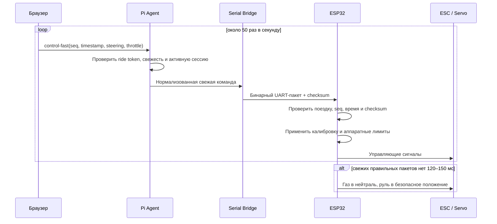

`control-fast` является unordered DataChannel без повторной доставки. Старые пакеты бесполезны и отбрасываются. `control-reliable` используется отдельно для готовности, начала и завершения логического управления и служебных команд.

### 7.4. Инварианты безопасности ESP32

- при старте и обновлении выходы нейтральны;
- без действующей поездки газ заблокирован;
- пакет другой поездки не принимается;
- повторный, повреждённый или устаревший пакет не применяется;
- максимальная скорость и задний ход ограничиваются на ESP32, а не только в UI;
- operator stop имеет приоритет над пользовательской командой;
- критический заряд блокирует продолжение;
- потеря Raspberry Pi, UART или WebRTC не может сохранить последнее значение газа.

---

## 8. WebRTC и медиаконтуры

### 8.1. Частный поток поездки

Основной маршрут:

`браузер пользователя ↔ Raspberry Pi`

Запасной маршрут:

`браузер пользователя ↔ TURN ↔ Raspberry Pi`

В одном WebRTC-сеансе передаются:

- 720p60-видео с адаптивным битрейтом и разрешением;
- звук отдельного микрофона;
- `control-fast`;
- `control-reliable`;
- ограниченная телеметрия поездки.

Сначала уменьшается битрейт, затем разрешение. Целевая частота 60 кадров в секунду сохраняется настолько долго, насколько позволяет оборудование и сеть.

### 8.2. Публичный поток и доказательная запись

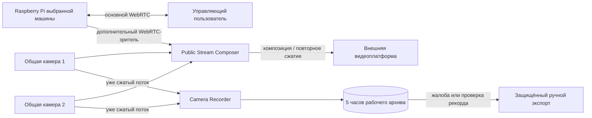

Разделение потоков обязательно:

- бортовое видео не записывается в MVP;
- публичный стрим не меняет прямой пользовательский маршрут;
- общие камеры записываются без повторного сжатия;
- публичная композиция может повторно сжиматься и отключается первой;
- архив общих камер хранит последние пять часов фактической работы, а не пустое время после закрытия;
- автоматической облачной выгрузки видео в MVP нет.

---

## 9. Система засечки и рейтинг

### 9.1. Архитектура адаптера

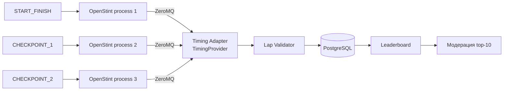

`TimingProvider` нормализует OpenStint, резервный Trackmate и симулятор в единое событие `TimingPass`. Бизнес-логика круга не должна зависеть от производителя оборудования.

Валидная последовательность:

`START_FINISH → CHECKPOINT_1 → CHECKPOINT_2 → START_FINISH`

Попадание в десятку лучших создаёт `pending_review`. Такой результат не становится подтверждённым лидером до решения модератора. При закрытии сезона создаётся неизменяемый снимок рейтинга.

---

## 10. Основной пользовательский и системный сценарий

### 10.1. От preflight до активной поездки

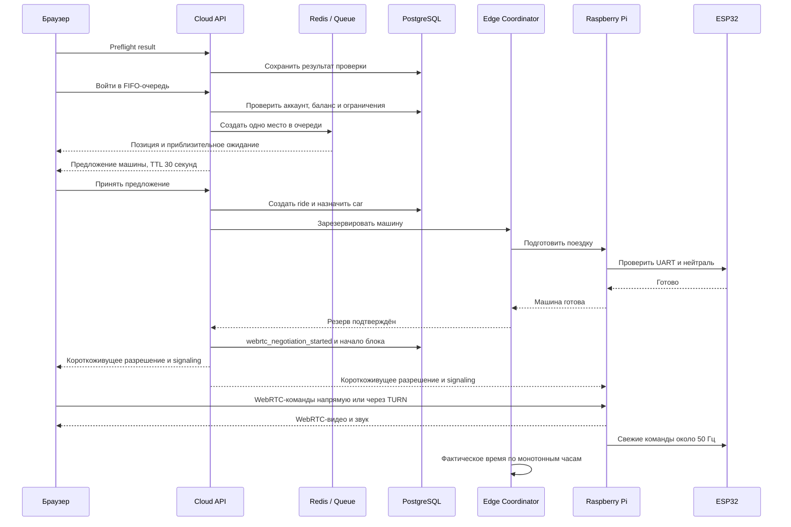

Оплачиваемый блок начинается именно на `webrtc_negotiation_started`, то есть до подтверждения успешного медиасоединения. Допускается не более пяти попыток. Если все попытки неуспешны, весь блок компенсируется.

### 10.2. Завершение и финансовое время

При штатном завершении:

1. браузер или таймер инициирует `ENDING`;
2. пользовательское разрешение отзывается;
3. ESP32 получает нейтраль;
4. edge фиксирует фактический временной сегмент;
5. событие с последовательным номером доставляется в облако;
6. облако завершает поездку и записывает итог в журнал;
7. оператор получает локальное управление для возврата;
8. после парковки и health-check машина снова может стать `AVAILABLE`.

При техническом сбое облако создаёт компенсирующую операцию на неиспользованные секунды. При добровольном досрочном завершении остаток текущего пятиминутного блока не возвращается.

### 10.3. Модель времени

| Что измеряется | Авторитетный источник |
|---|---|
| Финансовый баланс пользователя | Неизменяемый ledger в PostgreSQL |
| Начало оплачиваемого блока | Облачное событие `webrtc_negotiation_started` |
| Фактически активные и приостановленные сегменты | Local Ride Clock на монотонных часах |
| Обычные даты и аудит | UTC |
| Порядок локальных событий | Последовательный номер площадки / поездки |

Облако не доверяет повторной доставке как новому событию: каждый debit, credit, webhook, переход состояния и edge-событие имеет идемпотентный ключ.

---

## 11. Машины состояний

### 11.1. Состояние физической машины

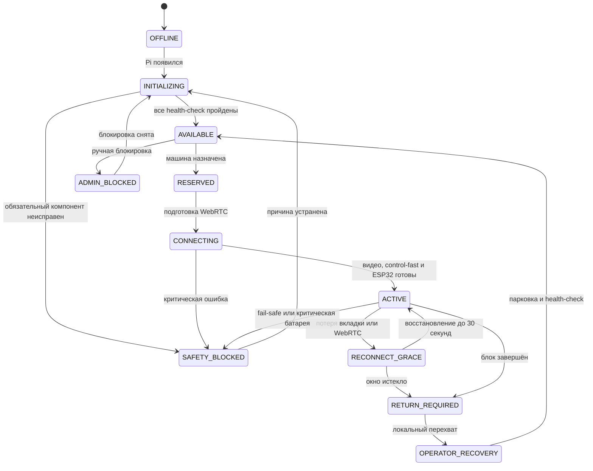

Переход в `AVAILABLE` разрешён только при исправных Pi, ESP32, камере, микрофоне и операторском канале, допустимом заряде, валидной калибровке, разрешённой версии и отсутствии административной блокировки.

### 11.2. Состояние поездки

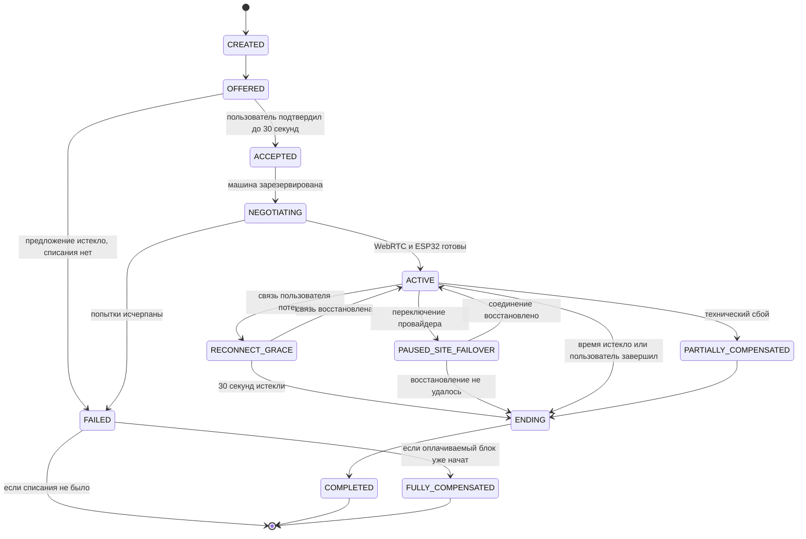

Каждый переход хранит время, причину, инициатора, версию и идемпотентный ключ. Локальная и облачная копии согласуются через outbox, но финансовый итог фиксируется в PostgreSQL.

---

## 12. Архитектура данных

### 12.1. Доменные области

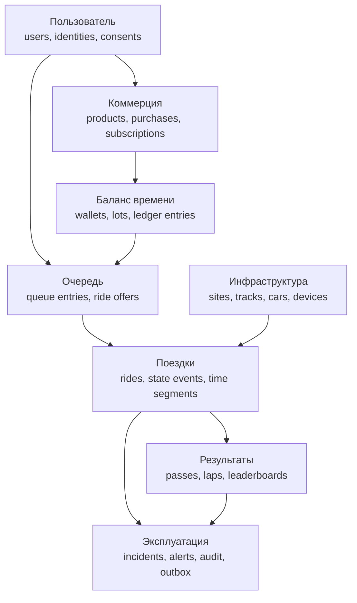

### 12.2. Основные правила данных

- денежные суммы хранятся в минимальных единицах валюты;
- баланс времени хранится целыми секундами;
- баланс вычисляется суммой неизменяемых операций;
- источник каждой секунды сохраняется в `wallet_lots`;
- одна покупка, подписка, компенсация или ручная корректировка создаёт отдельные записи;
- все обычные даты хранятся в UTC;
- монотонное время используется только для измерения длительностей на площадке;
- версии калибровки, Pi и ESP32 связываются с поездкой и призовым результатом;
- полные команды руля и газа не сохраняются;
- журналы не содержат секретов, карточных данных и лишних персональных данных.

### 12.3. Надёжная доставка событий

В облаке используется transactional outbox:

1. изменение доменной сущности и запись outbox выполняются в одной транзакции PostgreSQL;
2. worker публикует событие;
3. получатель применяет его по идемпотентному ключу;
4. повторная публикация безопасна.

На площадке используется durable local outbox:

1. событие получает последовательный номер;
2. сохраняется на устойчивом диске;
3. отправляется по исходящему защищённому соединению;
4. удаляется или архивируется только после подтверждения облаком;
5. после восстановления связи события передаются в исходном порядке.

### 12.4. Хранение и приватность

| Данные | Политика MVP |
|---|---|
| Бортовое видео и звук | Не записываются |
| Полные управляющие команды | Не записываются |
| Агрегаты связи и ключевые события | Хранятся для диагностики |
| Общие камеры | Последние пять часов фактической работы локально |
| Экспорт по жалобе | До 30 дней после закрытия, если нет legal hold |
| Финансовые и юридические данные | По утверждённому законному сроку |
| Raspberry Pi | Не считается долговременным хранилищем |

Интерфейс `IncidentObjectStorage` предусматривает будущую загрузку материалов в Google Cloud Storage, но бизнес-процесс жалобы MVP от неё не зависит.

---

## 13. API, события и протоколы

### 13.1. Карта интеграций

| Граница | Протокол | Назначение | Защита |
|---|---|---|---|
| Браузер ↔ Cloud API | HTTPS REST | аккаунт, каталог, кошелёк, очередь, поездка, история | OAuth-сессия, HttpOnly cookie, CSRF, rate limit |
| Браузер ↔ Cloud | WebSocket | очередь, предложение, состояние поездки, сигналинг, рейтинг | авторизованная сессия, версия сообщений |
| Браузер ↔ Raspberry Pi | WebRTC | видео, звук, `control-fast`, `control-reliable` | DTLS-SRTP, короткоживущее ride-разрешение |
| Браузер/Pi ↔ TURN | TURN | запасная ретрансляция WebRTC | краткоживущие credentials |
| Edge ↔ Cloud | исходящий защищённый WebSocket | команды, состояния, outbox, heartbeat | сертификат площадки, anti-replay |
| Pi ↔ Cloud | исходящее защищённое соединение | signaling, разрешения, состояние устройства | сертификат устройства |
| Edge ↔ Pi | локальный защищённый канал | operator stop, возврат, health и update coordination | сертификаты устройств и сетевой ACL |
| Pi ↔ ESP32 | бинарный UART | команды 50 Гц, статус, обновление прошивки | ride id, sequence, monotonic time, checksum |
| OpenStint ↔ Timing Adapter | ZeroMQ | проходы контрольных точек | локальная изолированная сеть |
| Камеры ↔ Edge | стандартный локальный видеопоток | архив и композиция | VLAN камер, ACL |
| Cloud ↔ Stripe | HTTPS API и webhook | покупки и подписки | подпись webhook, idempotency |

### 13.2. Контрактная дисциплина

- OpenAPI хранится в репозитории;
- TypeScript-клиент генерируется автоматически;
- Python-клиент Pi генерируется или проверяется тем же контрактом;
- WebSocket и UART сообщения версионируются;
- поддерживаемые версии машин получают обратно совместимые изменения;
- breaking change требует миграционного окна и canary;
- критическое событие содержит `correlation_id`, `ride_id`, `car_id`, `site_id`, `sequence` и `occurred_at`.

---

## 14. Безопасность и границы доверия

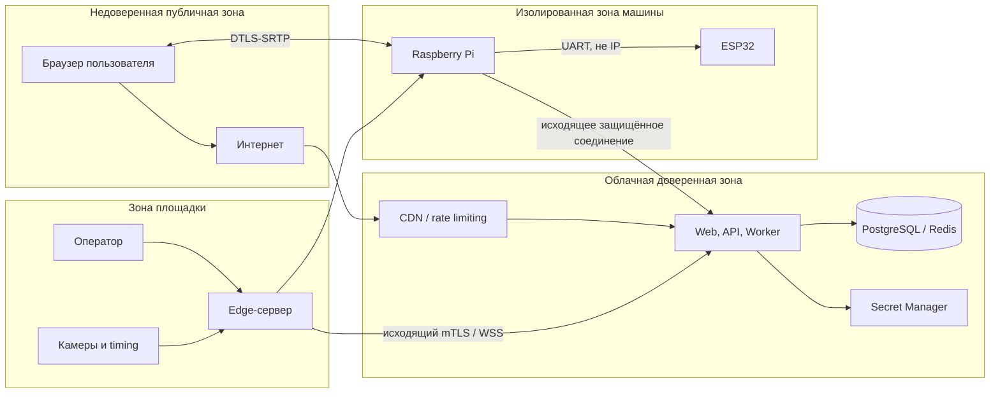

### 14.1. Основные меры

Пользовательский контур:

- Google OAuth с `state` и `nonce`;
- защищённые HttpOnly cookies;
- CSRF-защита;
- rate limiting и защита очереди от ботов;
- один активный контролирующий сеанс;
- отдельное хранение версий согласий.

Платежи:

- проверка подписи Stripe webhook;
- идемпотентная обработка;
- периодическая сверка;
- минимальные права ключей;
- отсутствие карточных данных в приложении и логах.

Площадка и устройства:

- уникальные сертификаты площадки и каждой Raspberry Pi;
- только исходящие интернет-соединения;
- отключённый публичный SSH;
- сегментация сети;
- короткоживущие разрешения поездки;
- подписанные обновления;
- ограниченные системные пользователи;
- восстановимый стандартный образ.

### 14.2. Обязательные security-инварианты

- второй браузер не может перехватить активное управление;
- старое ride-разрешение не работает после окончания поездки;
- компрометация одной Pi не даёт доступ к другим машинам, камерам и оператору;
- ESP32 не принимает сетевые команды напрямую;
- browser-side ограничение скорости не считается защитой;
- публичный API не содержит точного местоположения площадки;
- секреты не попадают в клиент, журнал, аналитику или видеопоток.

---

## 15. Наблюдаемость и эксплуатация

### 15.1. Сквозная корреляция

Каждая поездка должна прослеживаться по единому `correlation_id` через:

- REST и WebSocket;
- облачную оркестрацию;
- edge outbox;
- WebRTC negotiation attempts;
- Pi Agent;
- UART и причины fail-safe;
- timing events;
- ledger и компенсацию;
- действия оператора;
- жалобу.

Структурированные JSON-журналы связываются через `user_id`, `ride_id`, `car_id` и `site_id`, но не содержат секретов и лишних персональных данных.

### 15.2. Основные метрики

| Уровень | Метрики |
|---|---|
| Облако | OAuth success, Stripe webhook lag, ошибки покупок, глубина очереди, WebSocket connections, API errors |
| WebRTC | negotiation success, число попыток, direct/TURN ratio, RTT, packet loss, jitter, bitrate, frames, reconnect time |
| Edge | CPU, память, температура, диск, оба WAN, UPS, процессы, outbox lag |
| Машина | Pi heartbeat, Wi-Fi, температура, fps, UART, ESP32 heartbeat, батарея, fail-safe reason, версии |
| Бизнес | успешные поездки, компенсации, повторные покупки, подписки, конверсия |
| Засечка | пропуски, дубли, неверная последовательность, задержка события, top-10 review backlog |

### 15.3. Целевые показатели

- управляющие команды — около 50 Гц;
- нейтраль ESP32 после потери правильных пакетов — 120–150 мс;
- 720p60 и звук на эталонной машине;
- успешное WebRTC-подключение с учётом TURN — не ниже 95% тестовой выборки;
- медианная задержка «действие → видимая реакция» — ориентир до 180 мс;
- 95-й процентиль — ориентир до 300 мс;
- не менее 95% оплаченных поездок без системной компенсации после запуска;
- PostgreSQL RPO — не более пяти минут;
- PostgreSQL RTO — не более четырёх часов.

---

## 16. Отказоустойчивость

| Сбой | Автоматическая реакция | Финансовое поведение |
|---|---|---|
| Потеря управляющих пакетов | ESP32 включает нейтраль через 120–150 мс | блок продолжается по правилам потери связи |
| Закрытие вкладки / потеря WebRTC | нейтраль и 30 секунд `RECONNECT_GRACE` | текущий блок продолжает считаться |
| Все пять попыток WebRTC неуспешны | поездка завершается | полный возврат блока внутренним временем |
| Потеря облака | активная поездка продолжается локально; новые поездки и продления запрещены | edge копит события, ledger сверяется после восстановления |
| Потеря edge-сервера | машина останавливается | возврат неиспользованного остатка |
| Потеря Raspberry Pi или UART | ESP32 включает нейтраль | возврат неиспользованного остатка |
| Потеря ESP32 | машина блокируется | техническая компенсация |
| Переключение WAN | остановка, пауза локального таймера и восстановление | остаток возвращается, если восстановление неуспешно |
| Потеря Redis | финансовые данные сохраняются; очередь восстанавливается или сбрасывается | баланс не меняется |
| Отказ OpenStint | езда возможна, зачёт новых кругов приостанавливается | поездка не компенсируется автоматически |
| Отказ одной общей камеры | поездки продолжаются | призовой результат требует решения модератора |
| Переполнение диска камер | предупреждение оператору | управление не останавливается |
| Ошибка публичного стрима | перезапуск или отключение composer | поездка не затрагивается |
| Отключение питания | UPS даёт время на нейтраль и завершение | неиспользованный остаток возвращается |

### 16.1. Деградированные режимы

```mermaid
flowchart TD
    Normal["Нормальная работа"]
    NoPublic["Отключён публичный стрим"]
    NoSync["Нет облака, текущие поездки локально"]
    Paused["Site failover, машины остановлены"]
    Safety["Safety blocked"]

    Normal --> NoPublic: нехватка CPU или канала
    Normal --> NoSync: облако недоступно
    Normal --> Paused: переключение WAN
    NoSync --> Normal: облако восстановлено и outbox подтверждён
    Paused --> Normal: WebRTC восстановлен
    Paused --> Safety: восстановление невозможно
    Normal --> Safety: потеря Pi, ESP32, UART или critical battery
```

---

## 17. Развёртывание, репозитории и выпуск

### 17.1. Репозитории

```text
platform/
  apps/
    web/
    api/
    worker/
    edge/
  packages/
    contracts/
    domain/
    ui/
    config/
  infra/
  docs/

tether-rally-mjx/
  pi-agent/
  media/
  serial-protocol/
  esp32-firmware/
  simulators/
  image/
  scripts/
  docs/
```

`platform` содержит облако, edge и общие контракты. `tether-rally-mjx` сохраняет историю и MIT-атрибуцию Tether Rally и концентрирует код машины, медиа, UART и прошивки.

### 17.2. Среды

`development`, `staging` и `production` имеют отдельные:

- базы;
- секреты и ключи;
- Stripe mode;
- сертификаты устройств;
- домены и визуальную маркировку.

Тестовая среда не может списывать реальные деньги или управлять рабочей машиной без отдельного физического разрешения.

### 17.3. CI/CD

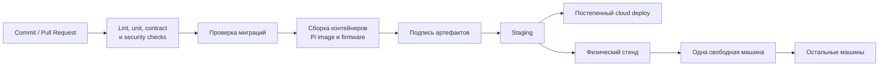

Правила выпуска:

- облако разворачивается постепенно;
- edge сначала проверяется в staging;
- Pi проверяется на стенде, затем на одной свободной canary-машине;
- активная машина не обновляется;
- ESP32 обновляется только через Pi и только в простое;
- после обновления проверяется нейтраль;
- при неуспешном health-check выполняется откат;
- текущая и целевая версии видны центральной системе.

### 17.4. Резервное копирование

Облако:

- непрерывный журнал PostgreSQL;
- регулярные снимки;
- проверяемое восстановление в отдельную среду;
- Redis не входит в финансовую резервную копию.

Площадка:

- durable outbox на устойчивом диске;
- конфигурации устройств синхронизированы с облаком;
- стандартный Compose и документация восстановления;
- экспортированные материалы исключаются из циклической очистки.

Машина:

- не содержит уникального долговременного состояния;
- восстанавливается стандартным образом, повторным enrollment и загрузкой управляемой конфигурации.

---

## 18. Масштабирование

### 18.1. От MVP к нескольким площадкам

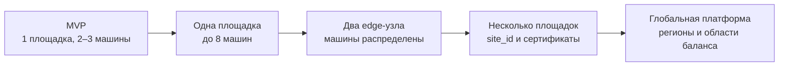

Для увеличения числа машин сначала масштабируются:

- Wi-Fi и радиоплан;
- вычислительные ресурсы edge;
- изоляция per-car процессов;
- емкость TURN;
- signaling instances;
- Redis и WebSocket routing.

При исчерпании одного edge-узла машины привязываются к двум узлам одной площадки. Каждый узел продолжает использовать общий облачный `site_id`, но имеет собственный `edge_node_id` и набор назначенных машин.

### 18.2. Выделение облачных сервисов

Модуль выносится из монолита только по измеримой причине:

| Кандидат | Причина выделения |
|---|---|
| WebRTC Signaling | большое число постоянных соединений и отдельный профиль масштабирования |
| Queue | глобальная очередь или высокая конкурентная нагрузка |
| Billing | отдельные финансовые требования и команда |
| Leaderboards | множество дисциплин, сезонов и тяжёлое чтение |
| Analytics | тяжёлые запросы, мешающие транзакционной базе |

Контракты модулей и outbox позволяют выполнить это без изменения бизнес-правил.

---

## 19. Тестовая архитектура

### 19.1. Симуляторы

- виртуальная машина с тестовым видеопотоком;
- Pi Agent simulator;
- ESP32 simulator;
- OpenStint simulator;
- симулятор батареи и разряда;
- потеря UART;
- queue load generator;
- WebRTC signaling client;
- Stripe test events.

Симуляторы должны использовать те же OpenAPI, WebSocket и UART-контракты, что и реальные компоненты.

### 19.2. Физический стенд

Минимальный стенд:

- полностью собранная машина с возможностью поднять колёса;
- эталонный геймпад;
- управляемое ухудшение сети;
- возможность отключить Pi, ESP32, UART, Wi-Fi и питание;
- одна тестовая точка OpenStint;
- открытый и коммерческий эталонный передатчики;
- прямой WebRTC и TURN;
- 30-минутные непрерывные тесты 720p60 со звуком.

### 19.3. Архитектурные проверки до запуска

- 100 последовательных пятиминутных стендовых поездок;
- поездки из внешних сетей и нескольких целевых стран;
- все сценарии компенсации и повторной доставки событий;
- потеря каждого критического компонента;
- очистка Redis;
- восстановление PostgreSQL;
- до восьми виртуальных машин;
- 1000 публичных страниц и 1000 участников очереди;
- отсутствие влияния публичного стрима на команды;
- физическое подтверждение fail-safe 120–150 мс;
- формальный выбор медиа-пути;
- формальное принятие OpenStint либо переход на Trackmate.

---

## 20. Архитектурные решения и исследовательские ворота

### 20.1. Принятые решения

| ID | Решение | Статус |
|---|---|---|
| ADR-001 | Модульный монолит вместо микросервисов | принято для MVP |
| ADR-002 | Прямой WebRTC, TURN как запасной путь | принято |
| ADR-003 | Edge измеряет фактическое время, облако ведёт финансовый ledger | принято |
| ADR-004 | ESP32 является независимым последним уровнем безопасности | принято |
| ADR-005 | PostgreSQL — источник истины, Redis — оперативное хранилище | принято |
| ADR-006 | Площадка и Pi инициируют исходящие защищённые соединения | принято |
| ADR-007 | Operator stop не зависит от пользовательского DataChannel и облака | принято |
| ADR-008 | Edge использует Docker Compose, Pi — systemd без Docker | принято |
| ADR-009 | Публичный стрим и архив отделены от управления | принято |
| ADR-010 | Повторная доставка безопасна благодаря outbox и idempotency | принято |
| ADR-011 | Timing и object storage скрыты за провайдерными интерфейсами | принято |

### 20.2. Исследовательские ворота

| Вопрос | Требуемое решение до production |
|---|---|
| MediaMTX/aiortc против актуального Pi WebRTC-пути | одинаковый тест на Pi Zero 2 W и выбор по задержке, стабильности и ресурсам |
| Производительность Pi Zero 2 W | подтвердить 720p60, звук, шифрование и управление либо перейти на более мощную плату |
| Wi-Fi 2,4 ГГц | тест 2, 4 и 8 машин; при провале перейти на 5 ГГц-оборудование |
| OpenStint | несколько тысяч проходов и формальные критерии; иначе Trackmate |
| Stripe и юридическая структура | подтвердить страну, банк, условия провайдера и контрольные платежи |
| TURN | измерить долю использования, стоимость, географию и задержку |

---

## 21. Связь архитектуры с интерфейсами

| Пользовательский экран | Архитектурные компоненты |
|---|---|
| [Главная и live-трасса](ui/01-home-live-track.png) | Next.js, Public API, CDN, Public Stream Composer, внешняя видеоплатформа |
| [Тарифы и подписки](ui/02-pricing-memberships.png) | Product Catalog, Stripe Billing, Wallet and Ledger |
| [Рейтинг сезона](ui/03-season-leaderboard.png) | Timing Adapter, Seasons, Leaderboards, Moderation |
| [Preflight](ui/04-preflight-controls.png) | браузерные проверки, STUN/TURN, WebRTC probe, API сохранения результата |
| [Живая очередь](ui/05-live-queue.png) | Queue, Redis, PostgreSQL checkpoints, WebSocket |
| [Интерфейс поездки](ui/06-driving-interface.png) | WebRTC, Pi Agent, ESP32, Local Ride Clock, timing events |
| [Результаты поездки](ui/07-ride-results.png) | Ride Orchestration, laps, leaderboard, incidents, compensation |

---

## 22. Итоговая архитектурная формула

Облако продаёт и учитывает время, организует FIFO-очередь, назначает машину и помогает браузеру и Raspberry Pi установить защищённый WebRTC-сеанс. После соединения видео, звук и свежие команды идут напрямую между пользователем и машиной либо через TURN, не проходя через бизнес-API.

Raspberry Pi обрабатывает медиа и переводит команды в проводной UART-протокол. ESP32 проверяет свежесть и целостность пакетов, применяет аппаратные ограничения и независимо переводит машину в безопасное состояние при любой потере правильных команд.

Локальный edge-сервер управляет площадкой: измеряет фактическое время, даёт оператору независимую остановку, принимает засечку, записывает общие камеры и продолжает текущую поездку при кратковременной потере облака. Его события сохраняются локально и идемпотентно синхронизируются с облачным журналом.

Публичная трансляция, видеоархив и аналитика намеренно отделены от критического пути. Поэтому их отказ ухудшает второстепенные функции, но не должен мешать оператору остановить машину, ESP32 включить нейтраль или платформе корректно посчитать оплаченные секунды.
