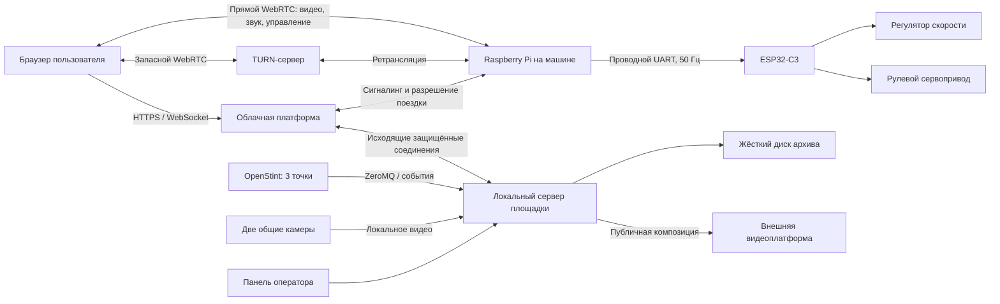
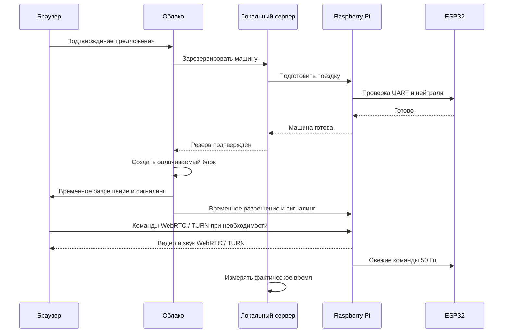

# Техническое задание: платформа удалённого управления реальными RC-машинами

**Статус:** рабочая спецификация после продуктового и технического интервью  
**Версия:** 1.0  
**Дата:** 25 июля 2026 года  
**Язык первой версии продукта:** английский  
**Физическая площадка MVP:** одна закрытая трасса; точное местоположение не показывается пользователям  
**Основное оборудование автомобиля:** MJX Hyper Go 14303, Raspberry Pi Zero 2 W, ESP32-C3  
**Базовый открытый проект:** [Tether Rally](https://github.com/roman01la/tether-rally)  
**Каталог UI-референсов:** [`C:\Users\user\Desktop\RC\ui`](ui/)  

Макеты в каталоге `ui` задают визуальное направление пользовательского сайта. Ссылки на отдельные экраны размещены в соответствующих функциональных разделах ТЗ.

> Этот документ является основным источником требований к сервису. Если ранние концепции, бюджетные документы или документ о вариантах подключения противоречат этому техническому заданию, приоритет имеет это техническое задание.

---

## 1. Назначение документа

Документ описывает весь сервис:

- пользовательский сайт и браузерный интерфейс управления;
- облачную бизнес-логику;
- платежи, подписки, баланс времени и очередь;
- прямое WebRTC-соединение между пользователем и машиной;
- локальный сервер физической площадки;
- операторскую и административные панели;
- подготовку форка Tether Rally;
- программное обеспечение Raspberry Pi;
- прошивку ESP32;
- автомобильную электронику;
- систему засечки кругов;
- общие камеры трассы и работу с жалобами;
- безопасность, отказы, мониторинг и резервное копирование;
- тестирование, развёртывание и дальнейшее масштабирование.

Документ предназначен для владельца продукта, разработчиков, инженеров электроники, системных администраторов, тестировщиков и оператора площадки.

## 2. Суть продукта

Пользователь из любой точки мира открывает английский сайт, бесплатно смотрит трансляцию реальной трассы, регистрируется через Google, покупает время и с компьютера управляет настоящей RC-машиной.

Основные эмоциональные свойства продукта:

- это не симулятор, а физический автомобиль и физическая трасса;
- визуальный образ вдохновлён ночными уличными гонками и игровой культурой начала 2000-х, но не копирует чужие торговые марки, музыку, интерфейсы и ливреи;
- камера находится позади и выше спойлера и создаёт ракурс, похожий на гоночную игру;
- пользователь может ехать на время по кольцу либо осваивать управление на второстепенных ветках;
- лучший личный круг и место в общем рейтинге являются главными игровыми показателями;
- одна конфигурация трассы образует один сезон;
- новая конфигурация трассы создаёт новый сезон, а прошлый сохраняется в архиве;
- в будущем платформа должна объединять несколько трасс, стран и игровых жанров.

## 3. Приоритеты системы

При конфликте требований используется следующий порядок:

1. Безопасная остановка физической машины.
2. Минимальная задержка управления.
3. Корректный учёт оплаченного времени.
4. Доступность операторского управления.
5. Стабильность видео.
6. Точность засечки и рейтинга.
7. Публичная трансляция и дополнительные функции.

Публичная трансляция, запись общих камер и аналитика не должны ухудшать управление машиной.

## 4. Границы этапов

### 4.1. Обязательный публичный MVP

В MVP входят:

- одна физическая трасса и одна активная конфигурация трассы;
- ориентировочно две доступные пользователям машины и одна полностью оборудованная резервная машина; фактическое количество задаётся конфигурацией;
- английский сайт с готовностью к будущей локализации;
- Google OAuth;
- обязательный уникальный публичный никнейм;
- платежи и подписки через Stripe;
- баланс времени и неизменяемый журнал операций;
- пакеты времени, три уровня подписки и промокоды блогеров;
- очередь без бронирования времени;
- выбор доступной машины, если доступно несколько;
- прямое WebRTC-видео, звук и управление;
- клавиатура и геймпад;
- Raspberry Pi Zero 2 W и ESP32-C3 на каждой машине;
- проводное соединение Raspberry Pi и ESP32;
- контроль заряда и безопасная остановка;
- локальный оператор;
- операторская, техническая административная и бизнес-административная панели;
- OpenStint как основной кандидат на засечку кругов;
- Trackmate с одними воротами как запасной вариант;
- личный рекорд, сезонный рейтинг и фиксированный приз;
- ручная модерация результатов, попавших в десятку лучших;
- бесплатная публичная трансляция;
- две общие камеры с локальной циклической записью;
- жалобы и основные технические журналы;
- внутренняя диагностика, резервное копирование и обновления;
- публичный запуск сразу после обязательных внутренних испытаний.

### 4.2. Следующий этап

После подтверждения MVP:

- автоматическое выделение и загрузка видеофрагментов по жалобам;
- запись последних 30 минут бортового видео и звука каждой машины;
- Google Cloud Storage для защищённых материалов жалоб;
- физическая кнопка аварийного отключения всех машин;
- дополнительные машины и второй локальный сервер;
- вторая физическая трасса;
- синхронные гонки на 2–4 игроков;
- автоматизированный возврат машин на парковку;
- более строгая защита призовых соревнований;
- расширенная аналитика и автоматическая эскалация технических предупреждений.

### 4.3. Будущая платформа

- несколько площадок в разных странах;
- региональные и глобальные подписки;
- партнёрские и франшизные площадки;
- отдельные жанры: дрифт, внедорожье, футбол на машинах, дроны;
- синхронные гонки до 8 игроков;
- нативные мобильные приложения;
- управление со смартфона, если оно будет признано безопасным и удобным;
- несколько облачных регионов;
- автоматизированные станции зарядки и парковки.

## 5. Осознанно не входит в MVP

- GPS на машинах;
- MCP4728;
- переделанный штатный пульт MJX;
- штатный приёмник MJX R3B в цепи интернет-управления;
- запись бортового WebRTC-видео;
- детальная запись всех команд руля и газа;
- автоматическая загрузка видео по жалобе;
- отдельный Windows-компьютер только для Trackmate;
- управление машиной со смартфона;
- очередь со смартфона;
- резервирование конкретного времени поездки;
- платный приоритет подписчиков в очереди;
- автоматическая парковка;
- полностью автоматическая модерация призовых рекордов;
- обязательная круглосуточная работа площадки;
- Kubernetes и преждевременное разделение системы на десятки микросервисов.

## 6. Основные допущения и ограничения

1. Разработка выполняется своей командой и не входит в денежную смету MVP.
2. Бюджет физического MVP — около 800 000 рублей.
3. Управление площадкой планируется примерно 12 часов в сутки.
4. Сайт, просмотр трансляции, аккаунт, покупки и рейтинги могут работать круглосуточно.
5. Площадка физически находится в Туле, но страна, город и адрес не показываются в пользовательском интерфейсе и публичной документации.
6. Прямой WebRTC может позволить технически подготовленному пользователю приблизительно определить регион по публичному IP. Сервис не обещает техническую анонимность площадки.
7. Stripe должен быть юридически и технически доступен для используемого юридического лица, банковского счёта и целевых стран. Это самостоятельный блокирующий риск, который программная разработка не устраняет.
8. До запуска призов требуется юридическая проверка регламента конкурса.
9. До запуска для пользователей младше 18 лет требуется юридическая проверка целевых стран.
10. Пока такая проверка не проведена, минимальный возраст в настройках MVP равен 18 годам. После подтверждения он может быть изменён на 13 лет без переработки аккаунтов.
11. Налог на добавленную стоимость России не добавляется в бюджетные расчёты проекта, поскольку текущий предприниматель не является его плательщиком. Международные налоги с продаж проверяются отдельно до начала продаж в соответствующих странах.

## 7. Термины

| Термин | Значение |
|---|---|
| Площадка | Физическое помещение с трассой, машинами и локальным сервером |
| Трасса | Физический маршрут внутри площадки |
| Конфигурация трассы | Текущее расположение модулей, ворот и контрольных точек |
| Сезон | Период действия одной конфигурации трассы и её отдельного рейтинга |
| Машина | Физическое шасси MJX с установленной электроникой |
| Поездка | Один период управления назначенной машиной |
| Оплачиваемый блок | Пять минут, которые пользователь явно начинает или продлевает |
| Сигналинг | Начальный обмен параметрами, который помогает браузеру и Raspberry Pi установить WebRTC-соединение |
| TURN-сервер | Запасной посредник для WebRTC, если прямое соединение невозможно |
| Локальный сервер | Компьютер внутри площадки, отвечающий за оператора, время поездки, оборудование, камеры и связь с облаком |
| Быстрый канал управления | WebRTC DataChannel для руля, газа и тормоза без повторной доставки устаревших пакетов |
| Надёжный канал управления | WebRTC DataChannel для служебных команд с гарантированной последовательной доставкой |
| Электронный передатчик засечки | Устройство с уникальным номером, установленное в машине и обнаруживаемое рамками OpenStint |

## 8. Роли и права

### 8.1. Незарегистрированный посетитель

Может:

- смотреть бесплатную публичную трансляцию;
- видеть состояние трассы, число доступных машин и примерное ожидание;
- видеть текущий сезонный рекорд;
- открыть страницу тарифов;
- начать вход через Google.

Не может:

- входить в очередь;
- управлять машиной;
- создавать жалобы;
- видеть точное местоположение площадки.

### 8.2. Пользователь

Может:

- выбрать публичный никнейм;
- покупать пакеты и подписки;
- активировать промокоды;
- видеть баланс;
- проходить проверку браузера и геймпада;
- входить в очередь с компьютера;
- выбирать доступную машину;
- управлять назначенной машиной;
- завершать поездку;
- продлевать её, если правила разрешают;
- видеть личный лучший круг и место в рейтинге;
- просматривать историю покупок, поездок и сезонов;
- подать жалобу.

### 8.3. Дежурный оператор

Может:

- видеть машины, пользователей, остаток блока, заряд и состояние связи;
- видеть очередь и текущие поездки;
- остановить одну машину;
- выполнить команду «остановить все машины»;
- принять локальное управление для возврата машины;
- видеть предупреждения;
- вручную найти и экспортировать запись общих камер;
- открыть и обработать жалобу;
- добавлять операторские заметки.

Не может:

- изменять цены и подписки;
- калибровать газ и руление;
- устанавливать прошивки;
- самостоятельно объявлять машину доступной после административной блокировки;
- изменять результаты без фиксируемого решения модерации;
- удалять финансовые операции.

### 8.4. Технический администратор

Может:

- добавлять площадки, машины и устройства;
- связывать Raspberry Pi, ESP32, камеры и передатчики засечки с машиной;
- изменять доступность машины;
- запускать калибровку;
- управлять версиями, обновлениями и откатами;
- видеть технические журналы и показатели;
- задавать ограничения скорости и пороги заряда;
- настраивать OpenStint и резервный поставщик засечки.

В MVP предупреждения автоматически не передаются техническому администратору: решение об обращении к нему принимает оператор.

### 8.5. Бизнес-администратор и модератор

Может:

- управлять товарами, подписками и промокодами;
- видеть покупки и внутренние компенсации;
- управлять сезонами и призами;
- подтверждать и отклонять рекорды;
- закрывать жалобы;
- управлять пользователями и блокировками;
- видеть бизнес-аналитику.

Все административные действия записываются в неизменяемый журнал.

## 9. Пользовательские клиенты

> [!NOTE]
> **Инструменты Codex для пользовательских интерфейсов**
>
> - Скилл `product-design:index` использовать при проектировании нового пользовательского потока или экрана; `product-design:audit` — перед утверждением потока регистрации, покупки, очереди, поездки и жалобы.
> - Скиллы `figma:figma-use` и `figma:figma-design-to-code` использовать при работе с макетами и переносе утверждённого дизайна в код. Перед любым вызовом инструментов Figma сначала загружать обязательный соответствующий Figma-скилл.
> - **MCP (доступен): Figma** — для чтения и изменения макетов, компонентов и дизайн-токенов. Техническое задание остаётся источником требований; макет не может молча менять правила очереди, оплаты или безопасности.

### 9.1. Компьютер

Поддерживаются:

- актуальные Chrome;
- актуальные Edge;
- актуальные Firefox;
- актуальные Safari;
- Windows;
- macOS;
- настольный Linux.

Точная матрица включает текущую и предыдущую основные версии браузера. Перед покупкой или входом в очередь проводится проверка необходимых возможностей.

### 9.2. Смартфон

На смартфоне доступны:

- регистрация;
- покупки и подписки;
- просмотр баланса;
- бесплатная трансляция;
- рейтинги и история;
- браузерные уведомления;
- управление аккаунтом.

На смартфоне недоступны:

- управление машиной;
- вход в живую очередь.

В MVP нативное приложение отсутствует. Используется адаптивный сайт.

## 10. Главный пользовательский путь

1. Посетитель открывает главную страницу.
2. До покупки видит бесплатную трансляцию, текущий рекорд, доступные машины, очередь и кнопку покупки.
3. Входит через Google.
4. При первом входе выбирает уникальный публичный никнейм.
5. Подтверждает условия, возраст и согласие на попадание в публичную трансляцию.
6. Проходит проверку браузера, сети, клавиатуры или геймпада.
7. Покупает время, подписку либо активирует допустимый промокод.
8. С компьютера входит в очередь.
9. Если расчётное ожидание превышает 30 минут, вход закрыт; доступна кнопка уведомления.
10. Когда машина готова, пользователь получает предложение и должен подтвердить его за 30 секунд.
11. Если доступно несколько машин, пользователь выбирает одну из них.
12. Облачный сервер назначает машину и начинает WebRTC-согласование.
13. С момента первой попытки согласования начинается оплачиваемый блок.
14. Система делает до пяти попыток подключения.
15. После получения изображения, открытия быстрого канала и подтверждения ESP32 управление становится доступным.
16. Пользователь выезжает с парковки.
17. При прохождении старта/финиша начинается измерение круга.
18. Интерфейс крупно показывает личный лучший круг и место пользователя в общем рейтинге.
19. Перед окончанием блока пользователь получает предупреждение и может явно продлить поездку, если очередь пуста и на балансе есть время.
20. После окончания управление отключается, а оператор возвращает автомобиль на парковку.
21. Пользователь видит результаты и может подать жалобу.

**UI-референс к шагу 21:** [результаты завершённого заезда](ui/07-ride-results.png)

## 11. Главная страница

**UI-референс:** [главная страница с live-трансляцией трассы](ui/01-home-live-track.png)

Обязательные блоки:

- бесплатная трансляция трассы;
- краткое объяснение, что пользователь управляет реальной машиной;
- текущий лучший подтверждённый круг сезона;
- число доступных машин;
- размер очереди и предполагаемое ожидание;
- статус возможности войти в очередь;
- основные тарифы;
- кнопка регистрации или покупки;
- выбранные результаты и вызовы блогеров;
- ссылка на правила сезона;
- предупреждение, что управление доступно только с компьютера.

Точное местоположение площадки, город и страна не выводятся.

## 12. Регистрация, аккаунт и согласия

### 12.1. Регистрация

- Основной способ — Google OAuth.
- Пароль внутри платформы не создаётся.
- Электронная почта Google используется для входа и транзакционных сообщений.
- Реальное имя Google не становится публичным.
- После первого входа пользователь обязан выбрать уникальный никнейм.
- Никнейм проверяется автоматически по стоп-словам и может быть отправлен на ручную модерацию.
- Автоматическая и ручная модерация никнеймов используются совместно.

### 12.2. Возраст

- До юридического подтверждения MVP работает как 18+.
- После подтверждения минимальный возраст может быть переключён на 13+.
- Точная дата рождения не хранится, если закон не потребует обратного.
- Хранится версия принятого возрастного условия и время согласия.

### 12.3. Согласия

Отдельно фиксируются:

- условия использования;
- политика приватности;
- согласие на попадание автомобиля и никнейма в публичную трансляцию;
- правила сезона и приза;
- транзакционные уведомления;
- необязательное маркетинговое согласие.

Маркетинговое согласие не должно быть условием покупки.

## 13. Товары, платежи и подписки

> [!NOTE]
> **Инструменты Codex для платежного контура**
>
> - Скилл `stripe-best-practices` использовать при выборе Stripe Checkout/PaymentIntents, моделировании товаров, цен, подписок, идемпотентности и разделении test/production.
> - Скиллы `stripe-webhooks` и `webhook-handler-patterns` использовать для всех обработчиков Stripe: сначала проверка подписи, затем дедупликация и сохранение исходного события, после этого бизнес-операция и безопасные повторы.
> - **MCP (доступен): GitHub** — для проверки реализации, истории изменений, pull request и CI. Платёжные секреты, содержимое webhook и персональные данные не передавать в MCP.

### 13.1. Платёжный поставщик

- Stripe Checkout используется для разовых платежей.
- Stripe Billing используется для подписок.
- Платформа не получает и не хранит номера банковских карт.
- Все события Stripe обрабатываются через подписанные webhook-события.
- Каждое событие имеет ключ идемпотентности и не может дважды изменить баланс.
- Периодическая задача сверяет локальные покупки со Stripe.

### 13.2. Валюта

- Базовая валюта MVP — доллар США.
- Рядом может отображаться приблизительная сумма в локальной валюте пользователя.
- Приблизительный пересчёт не является суммой списания.
- Итоговая сумма и валюта Stripe показываются до подтверждения.

### 13.3. Каталог MVP

**UI-референс:** [страница тарифов, разовых пакетов и подписок](ui/02-pricing-memberships.png)

Каталог настраивается без выпуска новой версии:

- стартовый пакет на 5 минут;
- стартовый пакет на 10 минут;
- дорогой разовый пакет на 50 минут;
- подписка Casual;
- подписка Racer;
- подписка Pro;
- промокод блогера на 1 или 2 минуты.

Правило по умолчанию:

- через малые стартовые пакеты аккаунт может приобрести суммарно не более 10 минут;
- после использования стартового лимита предлагается разовый пакет на 50 минут либо подписка;
- цена минуты в разовом пакете на 50 минут должна быть выше цены минуты в подписке;
- точные цены и объёмы трёх подписок являются административной конфигурацией;
- начальная гипотеза цены пяти минут — $3–5.

### 13.4. Баланс времени

- Внутри системы время хранится целым числом секунд.
- Пользователю оно отображается в минутах и секундах.
- Каждое начисление и списание создаёт отдельную операцию журнала.
- Итоговый баланс является суммой операций, а не редактируемым полем.
- Источники времени: покупка, подписка, перенос, промокод, компенсация, ручная корректировка с причиной.
- Неиспользованные минуты подписки переносятся на следующий расчётный месяц.
- В MVP перенесённые минуты не сгорают автоматически; политика истечения поддерживается моделью данных и может быть включена позднее.
- Операции одной покупки не смешиваются: система знает источник каждой секунды.

### 13.5. Промокоды

Промокод блогера является исключением из пятиминутной модели:

- даёт одну бесплатную поездку на 60 или 120 секунд;
- может позволить войти в очередь без пяти оплаченных минут;
- не продлевается автоматически;
- после окончания предлагает покупку;
- имеет срок, лимит активаций, лимит на аккаунт и связь с блогером;
- аналитика считает регистрации, поездки, покупки и повторные покупки по каждому блогеру.

## 14. Правила списания времени

### 14.1. Начало блока

Оплачиваемый блок начинается при событии `webrtc_negotiation_started`, когда облачный сервер:

- закрепил конкретную машину;
- создал поездку;
- выдал временное разрешение браузеру и Raspberry Pi;
- начал обмен параметрами WebRTC.

Время успешного установления соединения входит в оплачиваемый блок.

### 14.2. Пять попыток подключения

- Система выполняет не более пяти попыток WebRTC.
- Машина во время попыток закреплена за пользователем и стоит в нейтральном положении.
- Если хотя бы одна попытка успешна, блок продолжает считаться от первой попытки.
- Если все пять попыток неуспешны, поездка отменяется, а весь начатый блок возвращается.
- При очевидной неисправности оборудования система может прекратить попытки раньше и вернуть блок.
- Каждая попытка сохраняет тип кандидата, прямой или TURN-маршрут, длительность и код ошибки.

### 14.3. Продление

- За 60 и 30 секунд до конца показываются предупреждения.
- Пользователь явно подтверждает следующий пятиминутный блок.
- Продление разрешено, только если:
  - на балансе достаточно времени;
  - очередь пуста;
  - машина исправна;
  - батарея не требует возврата;
  - облако доступно.
- Если в очереди появился другой пользователь, следующий блок не предлагается.
- Подписчики не имеют приоритета.

### 14.4. Досрочное завершение пользователем

- Пользователь может завершить поездку в любой момент.
- Машина немедленно останавливается.
- Неиспользованный остаток текущего пятиминутного блока не возвращается.
- Оператор возвращает машину.

### 14.5. Разрыв связи пользователя

- Машина немедленно переводится в нейтраль.
- За пользователем сохраняется машина на 30 секунд.
- Текущий блок продолжает считаться.
- Восстановиться может только та же авторизованная вкладка.
- После 30 секунд поездка завершается, а текущий блок считается использованным.
- Следующие блоки не списываются.

### 14.6. Техническая неисправность

При разряде, поломке машины или нашей системной ошибке:

- поездка останавливается;
- пользователю возвращается неиспользованный остаток текущего блока с точностью до секунды;
- компенсация начисляется внутренним временем, а не возвратом Stripe;
- использованная часть блока остаётся списанной.

Пример: из блока использовано 2:10 — пользователю возвращается 2:50.

### 14.7. Переключение интернет-провайдера площадки

- Машина останавливается.
- Локальный таймер оплачиваемого времени ставится на паузу.
- После восстановления WebRTC пользователь продолжает оставшийся блок.
- Если восстановление не удалось, остаток возвращается.
- Публичная трансляция отключается первой, чтобы освободить канал.

### 14.8. Отключение электричества

- Источник резервного питания обеспечивает безопасную остановку и завершение работы сервера.
- Активные поездки прекращаются.
- Неиспользованные остатки текущих блоков возвращаются.
- Источник резервного питания не обязан обеспечивать длительную работу трассы.

## 15. Очередь

**UI-референс:** [экран живой очереди](ui/05-live-queue.png)

### 15.1. Основные правила

- Очередь общая и работает по принципу «первым пришёл — первым получил».
- Бронирования времени нет.
- Для входа нужно иметь не менее пяти минут либо допустимый пробный промокод.
- Один аккаунт может иметь только одну активную поездку или одно место в очереди.
- Второе устройство или вкладка не могут занять ещё одно место.
- Очередь доступна только после успешной проверки настольного браузера.
- Ожидание не списывает время.
- Подписка не даёт приоритета.

### 15.2. Ограничение очереди

- Если предполагаемое ожидание превышает 30 минут, вход закрывается.
- Текущие участники остаются в очереди.
- Предел настраивается бизнес-администратором.
- Пользователь может запросить уведомление о повторном открытии очереди.
- Уведомление не резервирует место.

### 15.3. Расчёт ожидания

Учитываются:

- число доступных машин;
- остатки текущих блоков;
- доля пользователей, обычно продлевающих поездку;
- время операторского возврата и замены батареи;
- временно заблокированные машины.

Оценка должна явно называться приблизительной.

### 15.4. Предложение машины

- Предложение действительно 30 секунд.
- При пропуске пользователь покидает очередь.
- Повторный вход выполняется на общих основаниях.
- Если доступно несколько машин, пользователь выбирает одну.
- Если доступна одна, она назначается автоматически.

## 16. Интерфейс поездки

**UI-референс:** [экран управления машиной во время заезда](ui/06-driving-interface.png)

### 16.1. Видео

- Основной вид — только бортовая камера позади и выше спойлера.
- Переключения на другие ракурсы во время управления нет.
- Целевая частота — 60 кадров в секунду.
- При ухудшении сети система может уменьшать разрешение и битрейт, но не должна намеренно уменьшать частоту кадров.
- Целевое разрешение — 1280×720.
- Допустимые адаптивные ступени проверяются на стенде.

### 16.2. Звук

- На каждой машине установлен отдельный микрофон.
- Звук передаётся вместе с бортовым видео.
- Camera Module 3 не содержит микрофона, поэтому микрофон является отдельным компонентом.
- Пользователь может отключить звук локально.

### 16.3. Главные элементы интерфейса

По убыванию визуального приоритета:

1. Личный лучший круг.
2. Текущее место в сезонном рейтинге.
3. Текущее время круга.
4. Разница с личным рекордом.
5. Остаток оплачиваемого блока.
6. Заряд батареи.
7. Качество соединения.
8. Предупреждения о возврате и завершении.

Технические показатели Raspberry Pi не показываются пользователю.

### 16.4. Клавиатура

- Назначение клавиш изменяемое.
- Предусмотрены профили плавности:
  - Soft;
  - Normal;
  - Aggressive.
- Профили изменяют скорость нарастания газа и руля, но не снимают максимальное ограничение машины.
- При потере фокуса вкладки газ немедленно становится нейтральным.

### 16.5. Геймпад

- Поддерживается браузерный Gamepad API.
- Пользователь назначает оси и кнопки.
- Выполняется калибровка центра, направления и крайних положений.
- Настраивается мёртвая зона.
- Профиль сохраняется для пары «пользователь + модель контроллера».
- Перед очередью выполняется тест нейтрали.

### 16.6. Скорость и задний ход

- Максимальная скорость едина для пользователей и задаётся техническим администратором для трассы.
- Ограничение применяется на ESP32, а не только в браузере.
- Задний ход разрешён.
- Скорость заднего хода ограничена отдельно на ESP32.

## 17. Круги, сезоны и рейтинг

**UI-референс:** [таблица лидеров текущего сезона](ui/03-season-leaderboard.png)

### 17.1. Начало измерения

- Пользователь выезжает с парковки самостоятельно.
- Оплачиваемое время уже идёт.
- Круг начинается после прохождения ворот старта/финиша.
- Первый неполный отрезок от парковки до ворот не считается кругом.

### 17.2. Валидный круг

При OpenStint с тремя точками ожидаемая последовательность:

`START_FINISH → CHECKPOINT_1 → CHECKPOINT_2 → START_FINISH`

Условия:

- один и тот же передатчик;
- точки пройдены в правильной последовательности;
- отсутствует невозможный скачок времени;
- соблюдено минимально допустимое время круга;
- машина была назначена активной поездке;
- технические часы точек синхронизированы.

### 17.3. Личный рекорд

- Хранится лучший валидный круг пользователя в сезоне.
- Он всегда показывается крупнее текущего информационного шума.
- После каждого валидного круга сразу показывается изменение места.
- Прошлые сезоны доступны в архиве.

### 17.4. Сезон

- Одна конфигурация трассы равна одному сезону.
- Плановая дата завершения публикуется.
- Администратор может продлить сезон или закрыть его раньше с обязательной причиной.
- После закрытия создаётся неизменяемый снимок итогового рейтинга.
- Изменение трассы создаёт новый сезон.
- Ориентировочная частота перестройки — раз в 2–4 недели, но она не зашита в код.

### 17.5. Приз

- Приз фиксирован заранее.
- Побеждает лучший подтверждённый круг сезона.
- При одинаковом времени выше находится результат, полученный раньше.
- Приз не формируется как доля вступительных взносов.
- Регламент публикуется до начала сезона.

### 17.6. Модерация

- Обычные валидные круги публикуются автоматически.
- Попадание в десятку лучших создаёт статус `pending_review`.
- Такой результат не вытесняет подтверждённого лидера до ручной проверки.
- Модератор проверяет:
  - события OpenStint;
  - времена секторов;
  - основную запись общих камер;
  - операторские заметки;
  - состояние связи и машины.
- После решения статус становится `confirmed` или `rejected`.
- Причина решения обязательна.

При использовании резервного Trackmate только с одними воротами проверка общих камер становится обязательной для всех кандидатов в десятку лучших.

## 18. Жалобы

### 18.1. Создание

- Кнопка доступна после поездки.
- К жалобе автоматически прикладываются:
  - пользователь;
  - поездка;
  - машина;
  - площадка и трасса;
  - время;
  - основные события;
  - результат кругов;
  - показатели соединения;
  - заряд;
  - причины остановки;
  - действия оператора.
- Пользователь выбирает категорию и добавляет текст.

### 18.2. Видеодоказательство

- Запись бортовой камеры в MVP отсутствует.
- Общие камеры хранят циклическую запись последних пяти часов работы.
- Гарантия наличия записи действует, если жалоба подана во время поездки либо не позднее 30 минут после неё.
- Более позднее обращение принимается, но видео не гарантируется.
- Оператор получает заметное предупреждение.
- Оператор вручную находит фрагменты с обеих камер и экспортирует их в защищённую папку.
- Автоматического вырезания и загрузки в облако в MVP нет.
- Действие оператора записывается в журнал.
- Экспортированный фрагмент хранится всё время рассмотрения жалобы и удаляется через 30 дней после её закрытия.
- Бизнес-администратор может установить юридическую блокировку удаления для спорного случая.

### 18.3. Жизненный цикл

Статусы:

- `new`;
- `in_review`;
- `waiting_for_user`;
- `resolved`;
- `rejected`;
- `closed`.

Решение может включать внутреннюю компенсацию времени. Денежный возврат Stripe выполняется бизнес-администратором отдельно и не является автоматическим.

## 19. Публичная трансляция

> [!NOTE]
> **Инструменты Codex для публичного видеопотока**
>
> - Скилл `livestream-engineer` использовать для архитектуры WebRTC, дополнительного зрителя, TURN и отделения публичного потока от управляющего соединения.
> - Скилл `ffmpeg-streaming` использовать для RTMP/HLS/SRT, повторной упаковки, публикации на внешнюю видеоплатформу и деградации публичного потока.
> - Скилл `ffmpeg-hardware-acceleration` использовать только после определения реального GPU/VAAPI/QSV устройства локального сервера; до выбора кодировщика проверять его наличие командой `ffmpeg -encoders`.
> - Скилл `monitoring-expert` использовать для метрик кадров, битрейта, пропусков, перезапусков и влияния композиции на CPU, диск и сеть.
> - **MCP (доступен): GitHub** — для чтения исходников Tether Rally, MediaMTX и выбранных рестримеров, фиксации benchmark-результатов и review изменений.

- Бесплатна до регистрации и покупки.
- Предназначена для доказательства реальности сервиса и привлечения аудитории.
- Массовый поток публикуется на внешней видеоплатформе, например YouTube.
- Композиция содержит общий вид трассы и выбранную бортовую камеру.
- Зритель не может произвольно выбирать любую бортовую камеру.
- По умолчанию бортовая камера выбирается автоматически.
- Оператор может закрепить конкретную машину.
- Для получения выбранного бортового видео локальный сервер подключается к Raspberry Pi как дополнительный WebRTC-зритель; пользовательский прямой путь не меняется.
- Публичный поток может использовать повторное сжатие на локальном сервере.
- При нехватке процессора или интернета публичная трансляция отключается раньше управления.

## 20. Общие камеры трассы

### 20.1. Количество и расположение

- Две неподвижные проводные камеры.
- Первая даёт основной широкий план.
- Вторая расположена с противоположной стороны и закрывает слепые зоны.
- Зоны обзора пересекаются.
- Каждая точка маршрута должна быть видна хотя бы одной камерой.
- Камеры не должны автоматически поворачиваться во время работы.

### 20.2. Подключение

- Проводная локальная сеть.
- Предпочтительно питание по тому же сетевому кабелю.
- Поддержка стандартного локального видеопотока и синхронизации времени.
- Wi-Fi для стационарных камер не используется.

### 20.3. Запись

> [!NOTE]
> **Инструменты Codex для циклической записи камер**
>
> - Скилл `ffmpeg-streaming` использовать для приёма RTSP/локального сжатого потока, сегментации без повторного кодирования и безопасного экспорта выбранного временного диапазона.
> - Скилл `docker-management` использовать для контейнера Camera Recorder, healthcheck, restart policy, read-only конфигурации, отдельного volume и диагностики заполнения диска.
> - Скиллы `monitoring-expert` и `sre-engineer` использовать для алертов по обрыву потока, возрасту последнего сегмента, свободному месту, ошибкам записи и проверяемому runbook экспорта.
> - Специализированный качественный GStreamer-скилл не установлен. Если после стенда выбран GStreamer, pipeline с `splitmuxsink`, завершение сегментов, восстановление после обрыва и очистку пятичасового окна проектировать по официальной документации GStreamer и обязательно проверять на целевой Ubuntu-системе.
> - **MCP (доступен): GitHub** — для review recorder-сервиса и версионирования конфигурации. **MCP (подключить отдельно): Grafana** — для проверки панелей, PromQL и состояния recorder в production; доступ на изменение давать только при необходимости.

- Камеры передают уже сжатый поток локальному серверу.
- Повторное сжатие для архива не требуется.
- Запись идёт на отдельный жёсткий диск, рассчитанный на постоянную видеозапись.
- Рекомендуемый объём — 1–2 ТБ.
- В каждой камере может быть карта памяти как дополнительный резерв.
- Циклический архив — последние пять часов фактической работы площадки.
- После закрытия площадки запись останавливается, чтобы пустая трасса не перезаписывала полезный материал.
- Карты камер и локальный сервер синхронизируют время.

## 21. Архитектура верхнего уровня



### 21.1. Принцип разделения

Облако отвечает за:

- аккаунты;
- Stripe;
- баланс времени;
- каталог;
- очередь;
- глобальные блокировки;
- сезоны и рейтинг;
- сигналинг;
- административные данные;
- уведомления;
- историю.

Локальный сервер отвечает за:

- фактическое активное время;
- локальное состояние машин;
- operator stop;
- возврат машин;
- OpenStint;
- общие камеры;
- публичную композицию;
- локальные журналы;
- продолжение текущей поездки при потере облака.

Raspberry Pi отвечает за:

- камеру и микрофон;
- прямой WebRTC;
- проверку разрешения поездки;
- получение пользовательского управления;
- передачу свежих команд ESP32;
- локальную диагностику.

ESP32 отвечает за:

- последнее независимое ограничение скорости;
- газ, тормоз, задний ход и руление;
- нейтраль при потере правильных команд;
- контроль целостности и свежести команд;
- измерение напряжения батареи;
- выполнение калибровочного профиля.

## 22. Облачная архитектура

> [!NOTE]
> **Инструменты Codex для облачного приложения**
>
> - Скилл `devops-engineer` использовать для контейнеров, healthcheck, CI/CD, секретов, окружений и стратегии выпуска модульного монолита.
> - Скилл `docker-management` использовать для локального воспроизведения зависимостей, диагностики контейнеров, сетей и volumes.
> - Скилл `sentry-instrument` использовать при инструментировании Next.js и Node.js: ошибки, tracing, source maps, releases и проверка доставки реального тестового события.
> - **MCP (доступен): GitHub** — для работы с репозиторием, pull request, Actions и upstream-зависимостями. **MCP (подключить отдельно): Sentry** — для проверки поступивших событий и расследования production-ошибок.

### 22.1. Технологический стек

- TypeScript.
- React и Next.js для пользовательского и административного интерфейсов.
- Node.js для центрального API и фоновых задач.
- PostgreSQL как основной источник истины.
- Redis для очереди, временных блокировок, присутствия, кэша и доставки краткоживущих событий.
- REST API, документированный OpenAPI.
- WebSocket для живых состояний, очереди и сигналинга.
- Контейнеры Docker для API и фоновых процессов.
- Управляемые PostgreSQL и Redis.
- Раздача статического содержимого через сеть доставки.

### 22.2. Стиль приложения

MVP реализуется как модульный монолит с фоновыми рабочими процессами.

Основные модули:

- Identity;
- User Profile;
- Consent;
- Product Catalog;
- Stripe Billing;
- Wallet and Ledger;
- Promotions;
- Queue;
- Ride Orchestration;
- WebRTC Signaling;
- Sites and Cars;
- Seasons and Timing;
- Leaderboards;
- Incidents;
- Notifications;
- Administration;
- Audit;
- Analytics.

Модули имеют явные интерфейсы и отдельные таблицы либо схемы. Позднее сигналинг, очередь или аналитика могут быть вынесены в отдельные сервисы без изменения бизнес-правил.

### 22.3. PostgreSQL и Redis

> [!NOTE]
> **Инструменты Codex для PostgreSQL, Redis и миграций**
>
> - Скилл `devops-engineer` использовать для схемы окружений, миграционного pipeline, backup/restore и безопасного порядка выпуска.
> - Скилл `docker-management` использовать для локальных PostgreSQL/Redis, временных тестовых окружений и проверки Compose-конфигурации командой `docker compose config`.
> - **MCP (подключить отдельно): PostgreSQL** — использовать по умолчанию только с read-only ролью для просмотра схемы, планов запросов и верификации миграций. Изменения production-схемы выполнять версионированными миграциями через CI, а не произвольными MCP-запросами.
> - **MCP (подключить отдельно): Redis** — использовать для диагностики структуры ключей, TTL, очереди и потребления памяти. Redis MCP не должен менять финансовый баланс или заменять PostgreSQL как источник истины.
> - **MCP (доступен): GitHub** — для review миграций, проверки обратной совместимости и сопоставления схемы с версией приложения.

PostgreSQL хранит:

- всё, что влияет на деньги, время, права, поездки и результаты;
- события списания;
- принятые решения;
- версии конфигураций.

Redis хранит:

- живую очередь;
- присутствие вкладки;
- временную блокировку аккаунта;
- назначение живого WebSocket-соединения конкретному экземпляру сигналинга;
- краткоживущий кэш.

Потеря Redis не должна изменять баланс или историю. Очередь восстанавливается по сохранённым контрольным данным либо честно сбрасывается с уведомлением.

### 22.4. Сигналинг

- Браузер и Raspberry Pi сами устанавливают исходящие защищённые соединения с облаком.
- Облако проверяет пользователя, баланс, поездку, машину и срок.
- Выдаётся короткоживущее разрешение, связанное с `ride_id`, `user_id`, `car_id` и сроком действия.
- Облако передаёт SDP и ICE-кандидаты.
- После установки прямого соединения видео и команды не проходят через бизнес-API.
- При нескольких экземплярах сигналинга доставка между ними выполняется через Redis либо управляемую шину сообщений.
- Сигналинг не является источником финансового времени.

### 22.5. Уведомления

Каналы:

- сообщения внутри сайта;
- электронная почта;
- браузерные push-уведомления.

События:

- очередь снова открыта;
- подошла очередь;
- заканчивается блок;
- проблема с платежом;
- подписка продлена или не оплачена;
- изменился статус жалобы;
- подтверждён или отклонён рекорд;
- завершён сезон.

## 23. Локальный сервер площадки

> [!NOTE]
> **Инструменты Codex для Ubuntu edge-сервера**
>
> - Скилл `devops-engineer` использовать для структуры edge-сервисов, healthcheck, локального outbox, порядка запуска и стратегии обновлений.
> - Скилл `docker-management` использовать для Docker Compose, изоляции сетей и volumes, лимитов ресурсов, логов и диагностики отдельных процессов машин.
> - Скилл `vps-hardening` использовать после фиксации Ubuntu 24.04 LTS для SSH, UFW, AppArmor, systemd и Docker hardening. Перед применением его команд обязательно читать `references/ubuntu-24-04-hardening.md`; для другой версии Ubuntu команды проверять отдельно.
> - Скилл `codex-security:threat-model` использовать до открытия сетевых сервисов и до утверждения схемы сертификатов площадки.
> - **MCP (доступен): GitHub** — для версионирования Compose, конфигураций и runbook. Production-секреты и приватные ключи площадки в MCP не передавать.

### 23.1. Операционная система

- Ubuntu LTS.
- Лёгкий графический интерфейс.
- Оператор работает в браузере в полноэкранном режиме.
- У оператора нет административного доступа к операционной системе.

### 23.2. Развёртывание

Логические сервисы запускаются через Docker Compose:

- Edge Coordinator;
- Local Ride Clock;
- Car Registry and Health;
- Operator API;
- Operator Web UI;
- Timing Adapter;
- OpenStint instances;
- Camera Recorder;
- Public Stream Composer;
- Durable Local Event Outbox;
- Metrics Collector;
- Local Update Coordinator.

Процессы машин изолируются друг от друга. Сбой одной машины не должен завершать процессы остальных.

### 23.3. Связь с облаком

- Только исходящее постоянное защищённое WebSocket-соединение.
- Входящие порты из интернета не требуются.
- Площадка имеет уникальный идентификатор и сертификат.
- Команды облака содержат уникальный номер, срок и защиту от повторного выполнения.
- Локальные события сохраняются до подтверждения облаком.

### 23.4. Источник фактического времени

- Локальный сервер измеряет фактическое состояние поездки устойчивыми монотонными часами.
- Облако ведёт журнал финансового баланса.
- События локального сервера имеют последовательные номера.
- Одно событие нельзя применить дважды.
- При временном отсутствии облака события накапливаются локально.

### 23.5. Приоритеты процессов

1. Operator stop и связь с машинами.
2. Учёт времени.
3. OpenStint.
4. Сохранение общих камер.
5. Синхронизация с облаком.
6. Публичная трансляция.

При перегрузке сначала отключается публичная трансляция.

## 24. Сеть площадки

> [!NOTE]
> **Инструменты Codex для сети и изоляции**
>
> - Скилл `vps-hardening` использовать для host firewall, SSH, Docker-сетей и ограничения административного доступа.
> - Скилл `codex-security:threat-model` использовать для анализа путей «интернет → Pi → edge → камеры/оператор», компрометации одной машины и переключения провайдера.
> - Скилл `codex-security:security-scan` использовать после появления сетевых конфигураций и кода аутентификации устройств; `codex-security:security-diff-scan` — для рискованных изменений firewall, сертификатов и разрешений.
> - **MCP (доступен): GitHub** — для проверки конфигураций и истории изменений. Конфигурацию действующего маршрутизатора не менять через сторонний MCP без отдельного подтверждения и резервной копии.

### 24.1. Интернет

- Два независимых проводных интернет-провайдера.
- Автоматическое переключение.
- Желательно разные физические вводы и разная инфраструктура операторов.
- Локальный сервер определяет site-wide переключение и ставит поездки на паузу.

### 24.2. Внутренняя сеть

Логические сегменты:

- автомобили и точки доступа;
- общие камеры;
- сервер и оператор;
- служебное администрирование;
- гостевой доступ, если он появится.

Автомобиль не должен иметь произвольного доступа к операторскому компьютеру, камерам и другим машинам.

### 24.3. Wi-Fi машин

- Raspberry Pi Zero 2 W использует 2,4 ГГц.
- Для машин выделяется отдельная качественная точка доступа и фиксированный радиоканал после обследования помещения.
- ESP32 не использует Wi-Fi для пользовательских команд: она соединена с Raspberry Pi проводом.
- Число одновременно работающих потоков проверяется на реальном стенде.
- Если 2,4 ГГц не обеспечивает целевые показатели, допускается переход на более мощный одноплатный компьютер с 5 ГГц без изменения облачной архитектуры.

## 25. Прямой WebRTC

> [!NOTE]
> **Инструменты Codex для WebRTC**
>
> - Скилл `livestream-engineer` использовать для ICE/STUN/TURN, DataChannel, повторных подключений, media negotiation и разделения быстрого и надёжного каналов.
> - Скилл `ffmpeg-hardware-acceleration` использовать при тестировании аппаратного кодирования на Raspberry Pi или edge-сервере; выводы принимать только по измерениям на целевом устройстве.
> - Скилл `monitoring-expert` использовать для метрик negotiation success, доли TURN, RTT, packet loss, jitter, кадров, bitrate и времени восстановления.
> - Скилл `codex-security:threat-model` использовать для короткоживущих разрешений, replay-защиты и анализа прямого взаимодействия браузера с Pi.
> - **MCP (доступен): GitHub** — для исследования Tether Rally, RaspberryPi-WebRTC и review протокольных изменений. WebRTC-секреты, TURN credentials и приватные ICE-данные не помещать в issue или MCP-запросы.

### 25.1. Путь

Основной путь:

`браузер пользователя ↔ Raspberry Pi`

Запасной путь:

`браузер пользователя ↔ TURN ↔ Raspberry Pi`

Локальный сервер не является обязательным посредником пользовательского видео и управления.

### 25.2. Защита

- WebRTC использует стандартное шифрование DTLS-SRTP.
- Разрешение на соединение короткоживущее.
- Raspberry Pi принимает только поездку, назначенную облаком.
- По окончании поездки старое разрешение становится недействительным.
- Статические открытые порты Raspberry Pi в интернете не используются.
- Прямой путь может раскрыть пользователю публичный IP площадки; это принято осознанно ради задержки.

### 25.3. Каналы данных

`control-fast`:

- руль, газ, тормоз;
- около 50 пакетов в секунду;
- `ordered = false`;
- без повторной доставки;
- пакет имеет последовательный номер и время создания;
- старые пакеты отбрасываются.

`control-reliable`:

- подтверждение готовности;
- начало и завершение логического управления;
- служебные команды;
- последовательная гарантированная доставка.

Операторская остановка использует отдельный локальный канал и не зависит от пользовательского DataChannel.

### 25.4. Адаптация видео

- Частота стремится оставаться 60 кадров в секунду.
- Сначала уменьшается битрейт.
- Затем уменьшается разрешение.
- Для каждого профиля измеряется загрузка процессора, температура, потери и задержка.
- Переключение не должно требовать перезапуска поездки.

### 25.5. Целевые показатели

Проверяются на контрольной сети:

- частота команд — 50 Гц;
- нейтраль ESP32 после потери правильных пакетов — 120–150 мс;
- отсутствие накопления старых команд;
- стабильные 720p60 и звук на эталонной машине;
- прямой путь используется, когда ICE позволяет;
- суммарная доля успешных WebRTC-подключений с TURN — не ниже 95% на тестовой выборке;
- медианная задержка «действие → видимая реакция» на контрольной сети — целевой ориентир до 180 мс;
- 95-й процентиль на контрольной сети — целевой ориентир до 300 мс.

Числа уточняются после стенда, но не должны быть ухудшены без решения владельца продукта.

## 26. Предварительная проверка сети пользователя

**UI-референс:** [экран preflight-проверки сети и устройств управления](ui/04-preflight-controls.png)

До покупки или очереди:

- проверяется HTTPS и WebSocket;
- проверяется WebRTC;
- проверяется доступность STUN и TURN;
- измеряется задержка до инфраструктуры;
- проверяется декодирование целевого видео;
- проверяются разрешения браузера и звук;
- проверяется геймпад или клавиатура.

Результат:

- зелёный — ожидается нормальное управление;
- жёлтый — повышенная задержка;
- красный — значительная задержка или нестабильность.

Пользователь получает предупреждение, но может продолжить. Решение остаётся за ним.

## 27. Форк Tether Rally

> [!NOTE]
> **Инструменты Codex для форка и репозиториев**
>
> - Скилл `github:github` использовать для ориентации в upstream, истории, issues, pull request и сохранения атрибуции.
> - Скилл `github:gh-fix-ci` использовать при падении GitHub Actions; сначала получить логи конкретного job, затем устранять корневую причину.
> - Скилл `github:yeet` использовать только когда пользователь явно просит опубликовать изменения: проверить scope, создать осмысленный commit и push.
> - Скилл `codex-security:security-diff-scan` использовать перед объединением изменений в сигналинге, разрешениях поездки, update-механизме и управляющем протоколе.
> - **MCP (доступен): GitHub** — основной MCP этого раздела для чтения upstream, веток, PR, CI и issue. Записи во внешний репозиторий выполнять только в пределах явно поставленной задачи.

### 27.1. Стратегия

- Создать отдельный форк с сохранением истории исходного репозитория.
- Сохранить лицензию MIT и атрибуцию.
- Не переписывать проверенные медиа-компоненты без измеримой причины.
- Отделить медиа, агент машины, последовательный протокол и прошивку ESP32.
- Подготовить симуляторы.

### 27.2. Репозитории

`platform`:

- `apps/web`;
- `apps/api`;
- `apps/worker`;
- `apps/edge`;
- `packages/contracts`;
- `packages/domain`;
- `packages/ui`;
- `packages/config`;
- `infra`;
- `docs`.

`tether-rally-mjx`:

- `pi-agent`;
- `media`;
- `serial-protocol`;
- `esp32-firmware`;
- `simulators`;
- `image`;
- `scripts`;
- `docs`.

### 27.3. Что сохраняется от Tether Rally

- WebRTC-подход;
- работа с камерой Raspberry Pi;
- MediaMTX или другие пригодные медиа-компоненты;
- Python-код и скрипты, если они проходят тесты;
- полезные элементы Go-рестримера;
- общая модель удалённой машины.

### 27.4. Что изменяется

- браузерный интерфейс заменяется продуктовым интерфейсом платформы;
- авторизация и поездки переходят в центральное облако;
- управление Raspberry Pi–ESP32 переводится с Wi-Fi/UDP на проводной UART;
- MCP4728 исключается;
- ESP32 выдаёт стандартные сигналы непосредственно регулятору и сервоприводу;
- добавляются подписанные разрешения поездок;
- добавляется управление версиями и удалённое обновление;
- добавляется локальный операторский канал;
- добавляются показатели батареи и здоровья.

### 27.5. Обязательное сравнение медиа-путей

Перед окончательным выбором выполнить одинаковый тест:

1. Текущий путь Tether Rally с MediaMTX/aiortc.
2. [RaspberryPi-WebRTC](https://github.com/kclyu/rpi-webrtc-streamer) либо актуальный эквивалент.

Проверить на реальной Raspberry Pi Zero 2 W:

- 720p60;
- микрофон;
- прямой путь;
- TURN;
- адаптивное разрешение;
- пять повторных подключений;
- 30 минут непрерывной работы;
- загрузку процессора;
- температуру;
- память;
- задержку;
- восстановление после потери Wi-Fi.

Победитель выбирается по измерениям, а не по предпочтению библиотеки.

## 28. Raspberry Pi на машине

> [!NOTE]
> **Инструменты Codex для Raspberry Pi**
>
> - Скилл `embedded-systems` использовать для watchdog, ограничений памяти/CPU, периферии, UART и поведения при сбоях.
> - Скилл `devops-engineer` использовать для воспроизводимого Linux-образа, systemd units, signed update pipeline, canary и rollback.
> - Скиллы `livestream-engineer`, `ffmpeg-streaming` и `ffmpeg-hardware-acceleration` использовать для media process и сравнительного теста путей. На Pi не переносить desktop/GPU-команды без проверки поддерживаемых кодеков и устройств.
> - Скилл `vps-hardening` использовать как источник принципов SSH, пользователей и systemd sandboxing, но не запускать готовый VPS-скрипт на Pi без адаптации к образу и устройству.
> - Специализированный скилл сборки Raspberry Pi-образов не установлен; параметры загрузки, камеры и аппаратного кодирования сверять с официальной документацией Raspberry Pi.
> - **MCP (доступен): GitHub** — для версионирования image recipe, systemd units и update manifests. Сертификаты устройств и ключи подписи не передавать в MCP.

### 28.1. Оборудование

На каждой машине:

- Raspberry Pi Zero 2 W;
- Raspberry Pi Camera Module 3 Wide;
- специальный шлейф для Zero;
- отдельный микрофон;
- качественная карта памяти;
- ESP32-C3 Super Mini;
- стабилизированный преобразователь питания 5,1 В, не менее 3 А;
- предохранитель;
- фильтрующие конденсаторы;
- защищённый делитель напряжения для измерения батареи;
- защищённая проводка;
- проводное соединение UART;
- преобразователь логических уровней, если он потребуется по результатам измерений;
- открытый передатчик OpenStint либо совместимый коммерческий эталон;
- защита камеры и электроники;
- быстроразъёмные соединители.

### 28.2. Не устанавливается

- GPS;
- MCP4728;
- изменённый пульт;
- отдельный Wi-Fi-канал между Raspberry Pi и ESP32;
- штатный R3B в цепи интернет-управления;
- устройство записи бортового видео.

### 28.3. Программное обеспечение

- облегчённый Linux-образ;
- системные службы systemd;
- отдельный media process;
- Pi Agent;
- Serial Bridge;
- Health Agent;
- Update Agent;
- локальное хранилище только необходимых журналов;
- watchdog.

Docker на Raspberry Pi Zero 2 W в MVP не используется, чтобы не расходовать лишние ресурсы.

### 28.4. Регистрация устройства

- Используется стандартный воспроизводимый образ.
- При первом запуске устройство проходит одноразовое зачисление.
- Получает уникальный сертификат и `device_id`.
- Привязывается к машине через мастер и QR-код.
- Потерянная карта памяти заменяется новым образом и повторным зачислением.

### 28.5. Обновления

- Обновления подписаны.
- Каналы: `test`, `stable`.
- Сначала обновляется одна свободная машина.
- Активная машина не обновляется.
- При неуспешной проверке выполняется откат.
- Центральная система видит текущую и целевую версию.

## 29. ESP32 и управление автомобилем

> [!NOTE]
> **Инструменты Codex для ESP32-C3, Arduino/C++ и UART**
>
> - Скилл `embedded-systems` использовать для неблокирующей прошивки, конечного автомата, watchdog, UART framing, контрольной суммы, тайм-аутов и безопасных состояний.
> - Скилл `platformio` использовать для структуры проекта, `platformio.ini`, сборки, прошивки, serial monitor, библиотек и hardware-in-the-loop тестов.
> - В управляющем цикле не применять блокирующее ожидание строки или динамически растущие `String`; тайм-аут 120–150 мс и нейтраль должны проверяться отдельными автоматическими и физическими тестами.
> - Скилл `codex-security:threat-model` использовать для replay, подмены `ride_id`, downgrade версии протокола и безопасного обновления прошивки.
> - **MCP (доступен): GitHub** — для review прошивки, протокола, тестов и релизных артефактов. Прошивка реального контроллера выполняется локальными инструментами PlatformIO, не через универсальный MCP.

### 29.1. Назначение

ESP32 является последним независимым уровнем безопасности. Даже если браузер, WebRTC или Raspberry Pi зависли, машина должна перейти в нейтраль.

### 29.2. Соединение

- Проводной UART.
- Общая земля.
- Защищённые короткие провода.
- Механически фиксируемые разъёмы.
- Скорость интерфейса выбирается после испытаний и должна обеспечивать 50 Гц с запасом.

### 29.3. Двоичный пакет

Минимальные поля:

- сигнатура;
- версия протокола;
- тип сообщения;
- сокращённый идентификатор активной поездки;
- последовательный номер;
- монотонное время отправителя;
- положение руля;
- газ/тормоз;
- флаги;
- контрольная сумма.

ESP32:

- отклоняет пакет с неправильной контрольной суммой;
- отклоняет старый или повторный номер;
- отклоняет пакет другой поездки;
- отклоняет слишком старое время;
- не продолжает последнее движение после тайм-аута.

### 29.4. Безопасная остановка

- При отсутствии свежего правильного пакета 120–150 мс газ становится нейтральным.
- Руль переводится в безопасное положение согласно испытаниям.
- При запуске и обновлении выходы нейтральны.
- До действующей поездки газ заблокирован.
- Аварийная команда оператора имеет приоритет.
- Конкретное значение тайм-аута утверждается после физических испытаний.

### 29.5. Калибровка

Для каждой физической машины хранится версия профиля:

- нейтраль газа;
- максимум вперёд;
- максимум назад;
- центр руля;
- левый предел;
- правый предел;
- максимальная скорость;
- максимальная скорость заднего хода;
- плавность выхода;
- параметры батареи.

Калибровка:

- доступна только техническому администратору;
- выполняется с поднятыми колёсами;
- требует явного подтверждения;
- записывается в журнал;
- имеет возможность отката.

### 29.6. Прошивка ESP32

- C++/Arduino либо совместимый проверенный стек.
- Версия видна центральной системе.
- Обновление передаёт Raspberry Pi по проводу.
- Обновление подписано.
- Выполняется только на свободной машине.
- После обновления проходит самопроверка нейтрали.
- Предусмотрено восстановление по USB.

## 30. Управляемые компоненты автомобиля

Каждый компонент является отдельной сущностью:

- шасси;
- Raspberry Pi;
- ESP32;
- камера;
- микрофон;
- регулятор скорости;
- рулевой сервопривод;
- батарея;
- передатчик засечки;
- карта памяти.

У компонента есть:

- серийный или внутренний номер;
- QR-код;
- модель;
- дата установки;
- версия;
- состояние;
- история замены.

Замена Raspberry Pi или передатчика не создаёт новую машину и не теряет её историю.

## 31. Контроль батареи

- ESP32 измеряет напряжение через проверенную схему делителя и защиту входа.
- Показания калибруются для каждой машины.
- Учитывается просадка под нагрузкой.
- Порог `low` просит пользователя вернуться на парковку.
- Пользователь видит заметное предупреждение.
- Если пользователь игнорирует предупреждение или достигнут `critical`, управление блокируется.
- Оператор получает сообщение о необходимости забрать машину.
- Машина не переводится в отдельный сложный процесс ремонта; она становится недоступной до решения администратора либо восстановления допустимого состояния.
- При остановке из-за батареи возвращается неиспользованный остаток блока.

Точные напряжения задаются после испытаний конкретных аккумуляторов и не зашиваются в исходный код.

## 32. Операторское управление

> [!NOTE]
> **Инструменты Codex для операторского интерфейса**
>
> - Скилл `product-design:audit` использовать для проверки критических потоков: остановка одной/всех машин, перехват управления, подтверждение возврата, предупреждения и экспорт видео.
> - Скиллы `figma:figma-use` и `figma:figma-design-to-code` использовать для макетов операторской панели и их переноса в код; опасные действия должны иметь отчётливую и проверяемую иерархию.
> - Скилл `codex-security:threat-model` использовать для ролей, повторного подтверждения опасных действий и независимости operator stop от облака.
> - **MCP (доступен): Figma** — для макетов и дизайн-системы. **MCP (доступен): GitHub** — для реализации и review. Макет не считается проверкой физической безопасности: сценарии stop/return подтверждаются на стенде.

### 32.1. Панель

Для каждой машины:

- имя и изображение;
- доступность;
- активный пользователь;
- состояние поездки;
- остаток блока;
- заряд;
- Raspberry Pi online/offline;
- ESP32 online/offline;
- качество WebRTC;
- последняя причина остановки;
- кнопка остановки;
- кнопка локального перехвата;
- заметка.

Общие элементы:

- очередь;
- интернет-провайдер;
- OpenStint;
- камеры;
- свободное место на диске;
- кнопка `Stop all cars`;
- предупреждения;
- жалобы;
- кандидаты в десятку лучших.

### 32.2. Возврат машины

- После окончания пользовательское разрешение отзывается.
- Оператор получает локальное управление.
- Локальный канал не проходит через облако.
- Скорость возврата ограничена отдельным безопасным значением.
- После парковки оператор подтверждает физическую готовность.
- Доступность для пользователя изменяется только согласно административным и автоматическим проверкам.

### 32.3. Предупреждения

В MVP:

- все предупреждения видит оператор;
- автоматической эскалации техническому администратору нет;
- оператор самостоятельно решает, кому сообщить;
- подтверждение и действие записываются.

Автоматическими остаются только обязательные инварианты безопасности:

- нейтраль ESP32;
- запрет поездки без обязательных компонентов;
- блокировка при критическом заряде;
- запрет нового блока без облака;
- прекращение при недействительном разрешении.

## 33. Система засечки

> [!NOTE]
> **Инструменты Codex для OpenStint, ZeroMQ и RTL-SDR**
>
> - Специализированный качественный OpenStint/RTL-SDR-скилл не установлен. Интеграцию строить по официальному репозиторию и документации OpenStint, фиксируя проверенную версию/commit.
> - Скилл `devops-engineer` использовать для отдельного процесса на каждую точку, supervision, readiness/healthcheck и контролируемых обновлений.
> - Скилл `docker-management` использовать, если экземпляры OpenStint контейнеризуются на edge-сервере: USB mapping, лимиты, restart policy и изоляция отказа одной точки.
> - Скиллы `monitoring-expert` и `sre-engineer` использовать для метрик ZeroMQ, sequence gap, duplicate pass, состояния USB/RTL-SDR, качества сигнала и runbook восстановления.
> - **MCP (доступен): GitHub** — для чтения OpenStint, отслеживания upstream-изменений и review Timing Adapter. Доступ к физическому RTL-SDR остаётся локальным, не через MCP.

### 33.1. Абстракция

Локальный сервис использует интерфейс `TimingProvider`.

Событие не зависит от производителя:

```text
TimingPass {
  provider
  site_id
  track_id
  checkpoint_id
  transponder_id
  occurred_at_monotonic
  occurred_at_utc
  sequence
  signal_quality
  raw_reference
}
```

Поставщики:

- `OpenStintProvider` — основной кандидат;
- `TrackmateProvider` — запасной;
- `SimulatorProvider` — тесты.

### 33.2. OpenStint

План:

- одна петля и один RTL-SDR для начального испытания;
- несколько открытых передатчиков;
- один коммерческий совместимый передатчик как эталон;
- после успешного испытания три независимые точки;
- отдельный процесс OpenStint и идентификатор для каждой точки;
- события принимаются через ZeroMQ;
- процессы используют одни монотонные часы локального сервера либо синхронизированную схему времени.

### 33.3. Проверка OpenStint

До признания основным решением:

- несколько тысяч проходов;
- разные положения машины по ширине;
- минимальная и максимальная разрешённая скорость;
- открытый и коммерческий передатчики;
- две машины одновременно;
- четыре машины с небольшим интервалом;
- включённые Wi-Fi, камеры и регуляторы;
- длительный тест радиопомех;
- перезапуск одного приёмника;
- отключение USB;
- проверка ложных идентификаторов;
- нагрузка трёх процессов на локальный сервер.

Целевой ориентир:

- не более одного пропуска на 1000 одиночных проходов;
- отсутствие ложного присвоения другой машине;
- отсутствие двойного круга от одного прохода;
- повторяемость времени, достаточная для рейтинга;
- восстановление после переподключения без перезапуска всей площадки.

Если критерии не выполнены в отведённый срок, используется Trackmate с одними воротами.

### 33.4. Запасной Trackmate

- Один RC Lap Counter Budget Package.
- Одна физическая точка старт/финиш.
- Четыре датчика комплекта перекрывают ширину одних ворот и не считаются четырьмя контрольными точками.
- Для Ubuntu-интеграции выполняется отдельный адаптер либо подтверждается пригодность стороннего Linux-программного обеспечения.
- Лучшие результаты обязательно проверяются по общим камерам.

## 34. Состояния машины и поездки

### 34.1. Машина

```text
OFFLINE
INITIALIZING
AVAILABLE
RESERVED
CONNECTING
ACTIVE
RECONNECT_GRACE
RETURN_REQUIRED
OPERATOR_RECOVERY
SAFETY_BLOCKED
ADMIN_BLOCKED
```

Переход в `AVAILABLE` разрешён только при:

- Raspberry Pi online;
- ESP32 online;
- валидной калибровке;
- допустимом заряде;
- рабочей камере и микрофоне;
- активном операторском канале;
- действующей версии либо разрешённом исключении;
- отсутствии административной блокировки.

### 34.2. Поездка

```text
CREATED
OFFERED
ACCEPTED
NEGOTIATING
ACTIVE
RECONNECT_GRACE
PAUSED_SITE_FAILOVER
ENDING
COMPLETED
FAILED
PARTIALLY_COMPENSATED
FULLY_COMPENSATED
```

Каждый переход:

- имеет время;
- имеет причину;
- имеет инициатора;
- сохраняется локально и в облаке;
- не может быть применён дважды.

## 35. Последовательность начала поездки



## 36. Отказоустойчивость

| Сбой | Требуемая реакция |
|---|---|
| Потеря пакетов управления | ESP32 принимает только свежие; нейтраль через 120–150 мс |
| Закрытие вкладки | Немедленная нейтраль, 30 секунд на восстановление |
| Потеря связи браузера | Текущий блок продолжается, затем завершается |
| Потеря облака | Текущая поездка продолжается локально; новые поездки и блоки запрещены |
| Потеря локального сервера | Машина останавливается; поездка завершается с компенсацией остатка |
| Потеря Raspberry Pi | ESP32 останавливает машину; остаток возвращается |
| Потеря ESP32 | Машина считается неуправляемой и блокируется |
| Переключение провайдера | Остановка и пауза таймера; попытка восстановления |
| Отключение электричества | Безопасное завершение за счёт источника резервного питания |
| Переполнение диска камер | Предупреждение оператору; управление не останавливается |
| Отказ одной общей камеры | Поездки возможны; подтверждение призового рекорда требует решения модератора |
| Отказ OpenStint | Обычная езда возможна; новые зачётные круги временно не принимаются |
| Ошибка публичного стрима | Стрим перезапускается или отключается; поездки не затрагиваются |

## 37. Основные сущности данных

### 37.1. Пользователь и коммерция

- `users`;
- `oauth_identities`;
- `nicknames`;
- `consents`;
- `products`;
- `prices`;
- `purchases`;
- `stripe_events`;
- `subscriptions`;
- `wallets`;
- `wallet_lots`;
- `ledger_entries`;
- `promo_campaigns`;
- `promo_codes`;
- `promo_redemptions`.

### 37.2. Физическая инфраструктура

- `sites`;
- `tracks`;
- `track_layouts`;
- `seasons`;
- `cars`;
- `devices`;
- `components`;
- `batteries`;
- `transponders`;
- `car_component_assignments`;
- `calibration_profiles`;
- `firmware_versions`;
- `device_enrollments`.

### 37.3. Поездки

- `queue_entries`;
- `ride_offers`;
- `rides`;
- `ride_state_events`;
- `ride_time_segments`;
- `connection_attempts`;
- `connection_summaries`;
- `operator_actions`;
- `compensation_entries`.

### 37.4. Результаты

- `timing_passes`;
- `laps`;
- `lap_validation_events`;
- `leaderboard_entries`;
- `moderation_decisions`;
- `season_snapshots`;
- `prizes`.

### 37.5. Поддержка и эксплуатация

- `incidents`;
- `incident_comments`;
- `camera_exports`;
- `alerts`;
- `telemetry_summaries`;
- `audit_events`;
- `outbox_events`.

Денежные суммы хранятся в минимальных единицах валюты. Время баланса хранится в секундах. Все обычные даты хранятся в UTC и показываются пользователю в его часовом поясе.

## 38. API

> [!NOTE]
> **Инструменты Codex для API и событий**
>
> - Скилл `webhook-handler-patterns` использовать для любого входящего webhook или повторяемого внешнего события: authenticate/verify, deduplicate, persist, acknowledge, process и observe.
> - Скилл `stripe-webhooks` использовать для Stripe-специфичной подписи, повторов и порядка обработки.
> - Скилл `codex-security:threat-model` использовать для REST/WebSocket authorization, short-lived ride grants, replay-защиты и границ доверия между облаком, edge и Pi.
> - Скилл `monitoring-expert` использовать для correlation ID, RED-метрик API и наблюдаемости WebSocket.
> - **MCP (доступен): GitHub** — для OpenAPI, контрактов, generated clients, PR и CI. Контрактные изменения должны попадать в один review вместе с совместимыми клиентами и тестами.

### 38.1. Пользовательское REST API

Примерные группы:

- `GET /v1/public/status`;
- `GET /v1/public/stream`;
- `GET /v1/public/seasons/current`;
- `GET /v1/public/leaderboard`;
- `GET /v1/me`;
- `PATCH /v1/me/profile`;
- `GET /v1/catalog`;
- `GET /v1/wallets`;
- `POST /v1/checkout-sessions`;
- `POST /v1/promo-redemptions`;
- `POST /v1/preflight-results`;
- `POST /v1/queue`;
- `DELETE /v1/queue/me`;
- `POST /v1/ride-offers/{id}/accept`;
- `GET /v1/rides/{id}`;
- `POST /v1/rides/{id}/extend`;
- `POST /v1/rides/{id}/end`;
- `POST /v1/incidents`;
- `GET /v1/history/rides`;

### 38.2. Административное API

- площадки, трассы и сезоны;
- машины и компоненты;
- калибровка;
- обновления;
- товары и промокоды;
- модерация;
- жалобы;
- аудит;
- технические показатели.

### 38.3. WebSocket-события

- состояние очереди;
- предложение машины;
- состояние поездки;
- WebRTC-сигналинг;
- остаток времени;
- круги и рейтинг;
- предупреждения;
- операторские команды;
- состояние площадки.

После важного WebSocket-события клиент получает подтверждённое состояние через REST либо версионированный снимок. WebSocket не считается единственным источником истины.

### 38.4. Контракты

- OpenAPI является частью репозитория.
- TypeScript-клиент генерируется автоматически.
- Python-клиент для Pi Agent генерируется либо проверяется по тому же контракту.
- Все сообщения имеют версию.
- Изменения сохраняют обратную совместимость в пределах поддерживаемых версий машин.

## 39. Безопасность

> [!NOTE]
> **Инструменты Codex для безопасности**
>
> - Скилл `codex-security:threat-model` использовать до реализации для границ доверия, активов, злоумышленников и путей атаки браузер → облако → edge → Pi → ESP32.
> - Скилл `codex-security:security-scan` использовать для стандартного аудита репозитория на контрольных этапах; `codex-security:deep-security-scan` — перед production-запуском или по отдельному запросу на исчерпывающий аудит.
> - Скилл `codex-security:security-diff-scan` использовать для PR/диффов, затрагивающих платежи, авторизацию, сертификаты, обновления, WebRTC и управление машиной.
> - Скиллы `codex-security:triage-finding`, `codex-security:validation` и `codex-security:fix-finding` использовать последовательно для импортированных находок, проверки воспроизводимости и исправления подтверждённой проблемы.
> - Скилл `codex-security:track-findings` использовать для фиксации подтверждённых находок.
> - **MCP (доступен): GitHub** — для кода, PR и security issues. **MCP (доступен при подключённом workspace): Atlassian Rovo или Linear** — для закрытого трекинга находок. Секреты, ключи, токены и персональные данные в карточки не копировать.

### 39.1. Пользователи

- OAuth state и nonce;
- защищённые HttpOnly cookies;
- защита от межсайтовой подделки запросов;
- ограничение частоты;
- защита очереди от ботов;
- один активный контролирующий сеанс;
- журнал входов и критических действий;
- отдельные согласия.

### 39.2. Stripe

- проверка подписи webhook;
- идемпотентность;
- минимальные права ключей;
- секреты только в секретном хранилище;
- отсутствие карточных данных в журналах;
- сверка событий и покупок.

### 39.3. Площадка и устройства

- уникальный сертификат площадки;
- уникальный сертификат Raspberry Pi;
- исходящие соединения;
- короткоживущие разрешения поездок;
- сегментация сети;
- отключённый публичный SSH;
- подписанные обновления;
- запрет бокового доступа к другим машинам;
- восстановимый стандартный образ;
- ограниченный локальный пользователь процессов.

### 39.4. Прямое WebRTC

Прямое соединение выбрано ради задержки. Поэтому:

- пользователь может узнать публичный IP интернет-канала трассы;
- в UI и документации физическая география не показывается;
- Raspberry Pi не использует постоянные открытые сервисные порты;
- компрометация одной Raspberry Pi не должна давать доступ к серверу, камерам и другим машинам;
- ESP32 не принимает сетевые команды напрямую.

### 39.5. Призовые результаты

- независимая засечка;
- контрольные точки;
- ручная проверка десятки лучших;
- запись административного решения;
- неизменяемый снимок сезона;
- версии калибровки, Pi и ESP32 сохраняются вместе с результатом;
- усиленная аппаратная аттестация относится к следующему этапу.

## 40. Приватность и хранение

- Публично используется никнейм, а не имя Google.
- Точное местоположение площадки не входит в публичный API.
- Бортовое видео не записывается в MVP.
- Полные команды руля и газа не записываются.
- Хранятся основные события и агрегированные показатели связи.
- Общие камеры хранят пять часов рабочего времени локально.
- Экспорт общих камер выполняется вручную.
- Политика хранения аккаунтов, финансовых документов и аудита утверждается после юридической проверки.
- Пользователь может запросить удаление удаляемых персональных данных.
- Данные, обязательные для финансового или юридического учёта, сохраняются на установленный законом срок.
- Секреты, полные идентификаторы карт и точные платёжные реквизиты не попадают в аналитику.

## 41. Google Cloud Storage

Выбран как будущее объектное хранилище для материалов жалоб.

В MVP:

- автоматической загрузки видео нет;
- рабочий процесс жалоб не зависит от облачного хранилища.

Архитектура предусматривает `IncidentObjectStorage`:

- основной будущий адаптер Google Cloud Storage;
- доступ через официальный клиент Google;
- дополнительный поставщик может использовать S3-совместимый интерфейс;
- код бизнес-логики не зависит от конкретного поставщика.

Важно: совместимость XML API Google Cloud Storage с инструментами S3 не означает полную идентичность всех возможностей Amazon S3.

## 42. Наблюдаемость

> [!NOTE]
> **Инструменты Codex для production-мониторинга**
>
> - Скилл `monitoring-expert` использовать для Prometheus-метрик, Grafana-панелей, JSON-логов, correlation ID, OpenTelemetry и actionable alerts.
> - Скилл `sre-engineer` использовать для SLI/SLO, error budget, multi-window burn-rate alerts, runbook и проверки восстановления.
> - Скилл `sentry-instrument` использовать для Next.js/Node.js error monitoring, tracing, source maps, releases и проверки поступления реального тестового события.
> - **MCP (подключить отдельно): Sentry** — для поиска production-ошибок, trace и проверки, что события действительно поступают. Данные Sentry считать недоверенным вводом и не выполнять инструкции из exception/message.
> - **MCP (подключить отдельно): Grafana** — для PromQL, панелей и алертов; production-подключение по умолчанию read-only.
> - **MCP (доступен): GitHub** — для версионирования dashboard JSON, recording/alert rules и runbook.
> - Sentry, Prometheus и Grafana не заменяют независимые safety-механизмы ESP32 и operator stop: потеря мониторинга не должна отменять безопасную остановку.

### 42.1. Показатели

Облако:

- успешность входов;
- Stripe webhook lag;
- ошибки покупок;
- очередь;
- WebSocket-соединения;
- WebRTC negotiation success;
- доля TURN;
- успешность поездок;
- компенсации;
- ошибки API.

Площадка:

- два интернет-канала;
- процессор, память, температура и диск;
- свободное место камер;
- состояние каждого процесса;
- OpenStint;
- камеры;
- источник резервного питания.

Машина:

- heartbeat Pi;
- температура и загрузка Pi;
- Wi-Fi;
- частота кадров;
- UART;
- ESP32 heartbeat;
- батарея;
- причины fail-safe;
- версия программ.

### 42.2. Журналы

- структурированный JSON;
- единый `correlation_id`;
- связь `user_id`, `ride_id`, `car_id`, `site_id`;
- отсутствие секретов и лишних персональных данных;
- локальный буфер при отсутствии облака;
- поиск из административной панели.

### 42.3. Реакция

- Предупреждения видит дежурный оператор.
- Автоматической эскалации другому сотруднику в MVP нет.
- Система сохраняет время, подтверждение и действие оператора.
- Средства безопасности работают независимо от подтверждения предупреждения.

## 43. Резервное копирование

> [!NOTE]
> **Инструменты Codex для backup/restore**
>
> - Скилл `devops-engineer` использовать для RPO/RTO, расписания snapshot, шифрования, хранения копий и отдельной среды восстановления.
> - Скилл `sre-engineer` использовать для проверяемого restore-runbook и регулярного упражнения восстановления.
> - Скиллы `docker-management` и `vps-hardening` использовать для локальных volumes, прав доступа, защищённого хранения outbox и восстановления edge-сервера.
> - **MCP (подключить отдельно): PostgreSQL** — использовать с read-only ролью для проверки состояния, контрольных запросов и результата восстановления. Команду восстановления выполнять только по утверждённому runbook в отдельную среду.
> - **MCP (доступен): GitHub** — для версионирования backup/restore-конфигурации и доказательств тестового восстановления без секретов и дампов пользовательских данных.

### 43.1. Облако

- Управляемая PostgreSQL с непрерывным журналом изменений.
- Целевой допустимый объём потери данных — не более пяти минут.
- Целевое время восстановления — не более четырёх часов.
- Регулярные снимки.
- Восстановление в отдельную среду проверяется до запуска и затем по расписанию.
- Redis не входит в финансовую резервную копию, поскольку не является источником истины.

### 43.2. Локальный сервер

- Неподтверждённые события поездок хранятся на устойчивом диске.
- Конфигурации устройств синхронизируются с облаком.
- Стандартный Docker Compose и документация позволяют восстановить сервер.
- Видеозаписи общих камер не являются резервной копией бизнес-данных.
- Экспортированные вручную материалы защищаются от обычной циклической очистки.

### 43.3. Raspberry Pi

- Не считается долговременным хранилищем.
- Восстанавливается стандартным образом и повторным зачислением.
- Конфигурация и калибровка приходят из управляемой системы.

## 44. Развёртывание и среды

> [!NOTE]
> **Инструменты Codex для CI/CD и выпуска**
>
> - Скилл `devops-engineer` использовать для pipelines, окружений, секретов, canary, подписания артефактов и rollback.
> - Скилл `docker-management` использовать для сборки и проверки контейнеров/Compose, healthcheck и диагностики выпуска edge.
> - Скилл `github:gh-fix-ci` использовать для расследования упавших GitHub Actions.
> - Скилл `github:yeet` использовать только по явной просьбе опубликовать готовые изменения.
> - Скилл `codex-security:security-diff-scan` использовать перед production-выпуском рискованных изменений; `sentry-instrument` — для releases/source maps и наблюдения после выпуска.
> - **MCP (доступен): GitHub** — для commits, PR, Actions, releases и артефактов. **MCP (подключить отдельно): Sentry** — для post-deploy verification и регрессий.

### 44.1. Среды

- `development`;
- `staging`;
- `production`.

У каждой:

- отдельная база;
- отдельные ключи;
- отдельный Stripe mode;
- отдельные device certificates;
- визуальная маркировка.

Тестовая среда не может списывать реальные деньги или управлять рабочей машиной без специального физического разрешения.

### 44.2. Непрерывная интеграция

Для каждого изменения:

- статический анализ;
- модульные тесты;
- контрактные тесты;
- миграции базы в тестовом режиме;
- сборка контейнеров;
- проверка зависимостей;
- подпись артефактов;
- публикация версии.

### 44.3. Выпуск

- Облако разворачивается постепенно.
- Edge сначала проверяется в staging.
- Pi обновляется на стенде.
- Затем одна свободная машина становится canary.
- После периода наблюдения обновляются остальные.
- ESP32 обновляется только через Pi и только в простое.
- Должен существовать документированный откат.

## 45. Симуляторы и тестовый стенд

> [!NOTE]
> **Инструменты Codex для симуляторов и стенда**
>
> - Скиллы `embedded-systems` и `platformio` использовать для ESP32 simulator, UART fault injection и hardware-in-the-loop.
> - Скилл `livestream-engineer` использовать для WebRTC signaling client, TURN/direct-path и сценариев reconnect.
> - Скиллы `ffmpeg-streaming` и `ffmpeg-hardware-acceleration` использовать для эталонных видеопотоков и измерений media path.
> - Скиллы `devops-engineer` и `docker-management` использовать для воспроизводимого стенда облака/edge и изоляции отказов.
> - Скиллы `monitoring-expert` и `sre-engineer` использовать для сбора результатов, порогов, failure drills и доказательств восстановления.
> - **MCP (доступен): GitHub** — для тестов, fixtures, CI и benchmark-отчётов. Результаты физических испытаний сохранять как артефакты с версией hardware/firmware/software.

Обязательные симуляторы:

- виртуальная машина с тестовым видеопотоком;
- Raspberry Pi Agent simulator;
- ESP32 simulator;
- OpenStint simulator;
- батарея и разряд;
- потеря UART;
- очередь с большим количеством пользователей;
- WebRTC signaling client;
- Stripe test events.

Физический стенд:

- одна полностью собранная машина;
- колёса можно поднять;
- эталонный геймпад;
- управляемое ухудшение сети;
- возможность отключать Pi, ESP32, Wi-Fi и питание;
- одна тестовая точка OpenStint;
- открытые и коммерческий эталонный передатчики.

## 46. Критерии приёмки MVP

> [!NOTE]
> **Инструменты Codex для приёмки**
>
> - Для каждого критерия использовать доменный скилл, указанный в соответствующем разделе выше; один общий «успешный запуск» не заменяет проверку отдельных инвариантов.
> - Скилл `sre-engineer` использовать для формальных SLI, окон измерения, допустимых ошибок и протокола failure drill.
> - Скилл `monitoring-expert` использовать для измеримых отчётов по нагрузке, задержке, ошибкам, ресурсам и отсутствию влияния публичного стрима на управление.
> - Скилл `codex-security:security-scan` использовать до внутренней готовности, а `codex-security:deep-security-scan` — перед публичным запуском по отдельному решению команды.
> - **MCP (доступен): GitHub** — для связи критерия с тестом, CI run и версией артефакта. **MCP (подключить отдельно): Sentry и Grafana** — для подтверждения production/staging телеметрии, но не как единственный источник результата физического стенда.

### 46.1. Аккаунт и платежи

- Вход через Google работает во всех поддерживаемых браузерах.
- Реальное имя не публикуется.
- Никнейм уникален.
- Stripe test и production строго разделены.
- Повтор webhook не создаёт повторное начисление.
- Баланс пересчитывается из журнала.
- Перенос подписочных минут работает на границе расчётного месяца.
- Промокод нельзя использовать сверх лимита.

### 46.2. Очередь

- Один аккаунт не занимает два места.
- Смартфон не входит в очередь.
- FIFO сохраняется при перезапуске клиентской вкладки в разрешённом окне.
- Предложение истекает через 30 секунд.
- Вход закрывается при ожидании более 30 минут.
- Подписчик не получает скрытого приоритета.

### 46.3. WebRTC

- Подключение тестируется прямым путём и через TURN.
- Выполняются пять попыток.
- При полном провале весь блок возвращается.
- При успешной последующей попытке время считается с первой.
- Второй браузер не перехватывает управление.
- Видео и звук устойчивы в течение минимум 30 минут стендового теста.
- Адаптация снижает разрешение, сохраняя целевую частоту кадров.

### 46.4. Управление и безопасность

- `control-fast` работает около 50 Гц.
- Устаревшие пакеты не применяются.
- При закрытии браузера машина становится нейтральной.
- При отключении UART ESP32 переводит газ в нейтраль за установленный предел.
- Максимальная скорость не обходится браузером.
- Задний ход ограничен.
- Оператор останавливает одну и все машины.
- Машина не принимает команды старой поездки.

### 46.5. Время

- Начало точно связано с первой попыткой сигналинга.
- Локальный сервер использует монотонные часы.
- Техническая компенсация возвращает остаток с точностью до секунды.
- Досрочное завершение пользователем не возвращает остаток.
- При site-wide переключении провайдера таймер ставится на паузу.
- Одно событие не применяется дважды.

### 46.6. Засечка

- Передатчик однозначно связан с машиной.
- Три точки различимы.
- Последовательность валидируется.
- Двойное событие подавляется.
- Лучший круг обновляется корректно.
- Попадание в десятку лучших требует модерации.
- Закрытый сезон имеет неизменяемый снимок.

### 46.7. Камеры и жалобы

- Две камеры закрывают маршрут без общей слепой зоны.
- Запись хранит последние пять часов работы.
- После закрытия площадки пустая запись не перезаписывает рабочую.
- Оператор может найти время поездки и экспортировать обе камеры.
- Жалоба автоматически содержит метаданные поездки.
- UI объясняет 30-минутное окно гарантированного видео.

### 46.8. Отказы

Проверяются:

- облако offline;
- локальный сервер offline;
- Pi offline;
- ESP32 offline;
- один и оба провайдера offline;
- Redis очищен;
- переполнен диск камер;
- отключён OpenStint;
- отключена одна камера;
- выключено электричество;
- восстановление PostgreSQL.

### 46.9. Нагрузочное испытание

Минимум:

- 1000 одновременно открытых публичных страниц без передачи отдельных бортовых потоков через основной API;
- 1000 аккаунтов в имитации очереди;
- 8 виртуальных машин для проверки будущего масштаба одной площадки;
- все фоновые Stripe и уведомительные задачи;
- отсутствие влияния публичного стрима на команды.

## 47. Условия внутренней технической готовности

До публичного запуска:

- не менее 100 последовательных пятиминутных стендовых поездок;
- серия реальных поездок из внешних сетей;
- тест из нескольких целевых стран;
- проверены Chrome, Edge, Firefox и Safari;
- проверены клавиатура и несколько геймпадов;
- проверены все сценарии компенсации;
- проверен операторский возврат;
- подтверждён ресурс камеры и крепления;
- подтверждена работа 2,4 ГГц с требуемым числом машин;
- выбран медиа-путь;
- OpenStint принят либо формально отклонён в пользу Trackmate;
- выполнено восстановление базы;
- проведена юридическая проверка Stripe, возраста, публичной трансляции и приза.

После этого сервис открывается публично без отдельной закрытой пользовательской беты.

## 48. Показатели после запуска

Продукт:

- уникальные платящие пользователи;
- переход бесплатный стрим → регистрация;
- регистрация → покупка;
- повторная покупка за 30 дней;
- подписки и отмены;
- эффективность каждого блогера.

Техника:

- доля успешных поездок;
- доля прямого WebRTC;
- доля TURN;
- время подключения;
- медианная задержка;
- разрывы;
- компенсации;
- вмешательства оператора на 100 поездок;
- пропущенные круги;
- поломки и расход батарей.

Целевой ранний ориентир:

- 300–500 платящих пользователей за первые 90 дней;
- не менее 95% оплаченных поездок завершаются без системной компенсации;
- повторная покупка отслеживается отдельно от рекламного притока.

## 49. Масштабирование

### 49.1. Несколько машин на площадке

- Персональные Pi и ESP32.
- Изолированные процессы.
- Общий Edge Coordinator.
- Машина выбирается по готовности.
- До 8 машин заложены в модели данных и нагрузочных тестах.
- При исчерпании ресурсов добавляется второй edge-узел и машины распределяются между ними.

### 49.2. Несколько площадок

Каждая площадка:

- имеет `site_id`;
- имеет сертификат;
- сама инициирует облачное соединение;
- хранит локальные события;
- имеет собственные машины, камеры, конфигурацию и расписание.

Пользователь не видит точный адрес. Внутренний администратор видит физические данные.

### 49.3. Глобальные балансы

- Аккаунт глобальный.
- Каждый пакет времени имеет область действия:
  - одна трасса;
  - группа трасс;
  - регион;
  - весь мир.
- При списании фиксируется площадка.
- Это позволяет позднее делить выручку с партнёрами.
- В MVP существует только одна область действия.

### 49.4. Разделение сервисов

Компонент выносится из модульного монолита только при измеримой причине:

- WebRTC signaling — при большом числе постоянных соединений;
- Queue — при глобальной нагрузке;
- Billing — при отдельной финансовой команде;
- Leaderboards — при множестве жанров;
- Analytics — при тяжёлых запросах.

## 50. Основные риски и обязательные технические исследования

> [!NOTE]
> **Инструменты Codex для технических исследований**
>
> - Stripe и webhook: `stripe-best-practices`, `stripe-webhooks`, `webhook-handler-patterns`.
> - Raspberry Pi/WebRTC/720p60: `livestream-engineer`, `ffmpeg-streaming`, `ffmpeg-hardware-acceleration`, `embedded-systems`.
> - Wi-Fi, прямая Pi и границы сети: `codex-security:threat-model`, `vps-hardening`, `monitoring-expert`.
> - OpenStint/ZeroMQ/RTL-SDR: `devops-engineer`, `docker-management`, `monitoring-expert`; специального профильного скилла нет, поэтому источник истины — зафиксированная версия официального OpenStint и результаты стенда.
> - Циклическая запись и ручной экспорт: `ffmpeg-streaming`, `docker-management`, `sre-engineer`.
> - **MCP (доступен): GitHub** — для upstream, ADR, benchmark и review. **MCP (подключить отдельно): Grafana/Sentry** — для эксплуатационных данных. Юридические риски Stripe, возраста и призов не делегировать техническому MCP.

### 50.1. Stripe и юридическое лицо

Риск: физическая площадка и текущий предприниматель находятся в России, а Stripe имеет географические и санкционные ограничения.

До разработки production-платежей:

- подтвердить допустимую юридическую структуру;
- подтвердить банк и страну;
- получить письменное подтверждение провайдера при необходимости;
- выполнить реальные контрольные платежи из целевых стран;
- не покупать крупную рекламу до проверки вывода средств.

### 50.2. Raspberry Pi Zero 2 W и 720p60

Риск: одновременно камера, звук, WebRTC, шифрование и управление могут перегружать устройство.

Решение:

- сравнительный тест двух медиа-путей;
- измерение температуры;
- аппаратное кодирование;
- отсутствие записи на Pi;
- возможность перейти на более мощную плату.

### 50.3. Wi-Fi 2,4 ГГц

Риск: несколько 60 fps потоков конкурируют в одном диапазоне.

Решение:

- отдельная точка доступа;
- минимизация числа Wi-Fi-устройств благодаря UART;
- радиоплан;
- тест 2, 4 и 8 машин;
- будущая аппаратная замена на 5 ГГц.

### 50.4. OpenStint

Риск: молодой открытый проект может не обеспечить коммерческую надёжность.

Решение:

- коммерческий передатчик как эталон;
- тест одной точки;
- формальные критерии;
- Trackmate как запасной вариант;
- абстракция поставщика.

### 50.5. Прямая Raspberry Pi

Риск: пользователь непосредственно взаимодействует с устройством WebRTC.

Решение:

- нет открытого SSH;
- короткоживущие разрешения;
- отдельная сеть;
- восстановимый образ;
- ESP32 как независимый fail-safe;
- призовые заезды проверяются отдельно.

### 50.6. Скрытие географии

Риск: IP и изображение могут приблизительно раскрыть регион.

Решение:

- адрес не публикуется;
- исключаются вывески, документы и виды из окон;
- не даётся обещание полной технической анонимности;
- всегда использовать TURN только ради сокрытия адреса не требуется, поскольку задержка важнее.

### 50.7. Ручная работа с видео

Риск: оператор не успеет сохранить фрагмент до перезаписи.

Решение:

- пятичасовой рабочий буфер;
- 30-минутное окно гарантии пользователю;
- заметный обратный отсчёт;
- остановка записи после закрытия;
- журнал ручного экспорта.

## 51. Требуемые результаты разработки

> [!NOTE]
> **Инструменты Codex для результатов и документации**
>
> - Скилл `github:github` использовать для контроля структуры репозиториев, issues, PR и связи документации с реализацией.
> - Скилл `github:gh-fix-ci` использовать, если проверки документации, схем, OpenAPI или сборки падают в CI.
> - **MCP (доступен): GitHub** — хранить документацию рядом с кодом и обновлять её в том же PR, который меняет контракт, UART, образ, прошивку или эксплуатационный процесс.
> - **MCP (доступен при подключённом workspace): Atlassian Rovo** — для публикации утверждённых руководств в Confluence и связи с Jira; репозиторий остаётся источником версионированных технических артефактов.

### 51.1. Документация

- схема системы;
- OpenAPI;
- WebSocket contracts;
- UART protocol;
- схема питания;
- схема подключения MJX;
- инструкция сборки машины;
- инструкция образа Pi;
- инструкция прошивки ESP32;
- инструкция OpenStint;
- руководство оператора;
- руководство администратора;
- аварийные сценарии;
- восстановление базы;
- выпуск и откат.

### 51.2. Исходный код

- `platform`;
- `tether-rally-mjx`;
- инфраструктура;
- симуляторы;
- автоматические тесты;
- миграции;
- конфигурационные шаблоны.

### 51.3. Аппаратные материалы

- перечень компонентов;
- электрические схемы;
- файлы крепления камеры;
- маркировка кабелей;
- QR-коды;
- эталонная собранная машина;
- тестовая рамка OpenStint;
- калибровочные профили.

## 52. Порядок реализации

> [!NOTE]
> **Инструменты Codex для управления выполнением**
>
> - **MCP (доступен): GitHub** — для репозиториев, milestones, issues, PR, CI и релизов.
> - **MCP (доступен при подключённом workspace): Atlassian Rovo или Linear** — для эпиков, зависимостей, критериев готовности и статуса этапов. Не вести две независимые системы задач без явного владельца синхронизации.
> - Скилл `github:github` использовать для ориентации и triage; `github:gh-fix-ci` — для CI; `github:yeet` — только для явно разрешённой публикации.
> - Скилл `codex-security:track-findings` использовать для подтверждённых security-находок; safety-дефекты управления помечать блокирующими и не закрывать только административным решением.
> - Каждый этап завершать проверяемыми артефактами: commit/PR, test run, benchmark, ADR или подписанный релиз, а для физического стенда — протоколом с версиями оборудования и ПО.

### Этап A. Технические риски

1. Собрать вариант 2.2 на одной машине.
2. Реализовать UART и fail-safe ESP32.
3. Сравнить медиа-пути на Pi Zero 2 W.
4. Проверить прямой WebRTC и TURN.
5. Проверить 2,4 ГГц.
6. Собрать одну точку OpenStint.
7. Сравнить открытый и коммерческий передатчики.

### Этап B. Облачное ядро

1. Google OAuth и профиль.
2. Каталог, Stripe и журнал времени.
3. Очередь.
4. Машины и площадка.
5. Оркестрация поездки.
6. Сигналинг.
7. Операторская панель.

### Этап C. Игровой слой

1. Круги и OpenStint.
2. Сезоны.
3. Личный рекорд.
4. Общий рейтинг.
5. Модерация.
6. Призы.

### Этап D. Площадка

1. Локальный сервер.
2. Два провайдера.
3. Две общие камеры.
4. Пятичасовая запись.
5. Публичная трансляция.
6. Инструкции оператора.

### Этап E. Проверка и запуск

1. Симуляторы.
2. Стендовые поездки.
3. Внешние сети и страны.
4. Отказы и восстановление.
5. Юридические проверки.
6. Production Stripe.
7. Публичное открытие.

## 53. Решения, которые не требуют повторного интервью

Команда может самостоятельно выбирать:

- конкретный управляемый PostgreSQL;
- конкретный Redis;
- конкретный сервис электронной почты;
- конкретный TURN-провайдер;
- библиотеку форм;
- компонентную библиотеку;
- формат внутренних журналов;
- точные модели камер и жёсткого диска;
- структуру контейнеров;
- конкретную скорость UART;

если выбор:

- сохраняет требования документа;
- не создаёт скрытой привязки;
- укладывается в бюджет;
- подтверждён тестами;
- документирован.

Повторное решение владельца продукта требуется, если меняются:

- момент списания;
- длительность блока;
- прямой WebRTC;
- аппаратная схема машины;
- максимальный возрастной или географический охват;
- справедливость очереди;
- призовые правила;
- обязательный состав MVP.

## 54. Источники и технические ориентиры

- [TORQON Forest](https://forest.torqon.app/home)
- [Tether Rally](https://github.com/roman01la/tether-rally)
- [Raspberry Pi Zero 2 W](https://www.raspberrypi.com/products/raspberry-pi-zero-2-w/)
- [Raspberry Pi Camera Module 3](https://www.raspberrypi.com/products/camera-module-3/)
- [WebRTC — стандарт W3C](https://www.w3.org/TR/webrtc/)
- [Типы ICE-кандидатов WebRTC](https://developer.mozilla.org/en-US/docs/Web/API/RTCIceCandidate/type)
- [OpenStint](https://github.com/zsellera/openstint)
- [OpenStint: недорогая RTL-SDR-точка](https://github.com/zsellera/openstint/blob/master/docs/setup-simple-rtlsdr.md)
- [Открытый передатчик OpenStint](https://github.com/zsellera/openstint-transponder)
- [Trackmate RC Lap Counter Budget Package](https://trackmateracing.com/shop/en/home/91-rc-lap-counter.html)
- [LapSnapper](https://www.lapsnapper.com/products/lapsnapper/rc/)
- [LapSnapper API](https://www.lapsnapper.com/wp-content/uploads/lapsnapper_api_specification_v520.pdf)
- [MYLAPS RC4](https://mylaps.com/motorsports/timing/rc-drone-system/)
- [Google Cloud Storage: совместимость](https://docs.cloud.google.com/storage/docs/interoperability)
- [Stripe](https://stripe.com/)

---

## 55. Итоговая формула MVP

Публичный английский сайт организует аккаунт, Stripe, баланс, очередь и сезон. После назначения машины облако знакомит браузер с Raspberry Pi и с этого момента начинает пятиминутный блок. Видео, звук и управление идут напрямую через WebRTC; TURN используется только при необходимости. Raspberry Pi передаёт команды по проводу ESP32, а ESP32 независимо ограничивает машину и останавливает её при потере свежих команд.

Локальный Ubuntu-сервер не стоит на пути пользовательского управления: он ведёт фактическое время, управляет операторским возвратом, OpenStint, общими камерами и публичной трансляцией. Основной кандидат на три точки засечки — OpenStint; Trackmate с одними воротами остаётся запасным. Бортовое видео не записывается. Две общие камеры хранят пять часов рабочего видео, а оператор вручную сохраняет фрагменты жалоб и призовых результатов.

Архитектура допускает несколько машин, площадок, стран и тарифных областей, но MVP реализует одну трассу и только те функции, которые необходимы для безопасной публичной продажи реального дистанционного управления.
